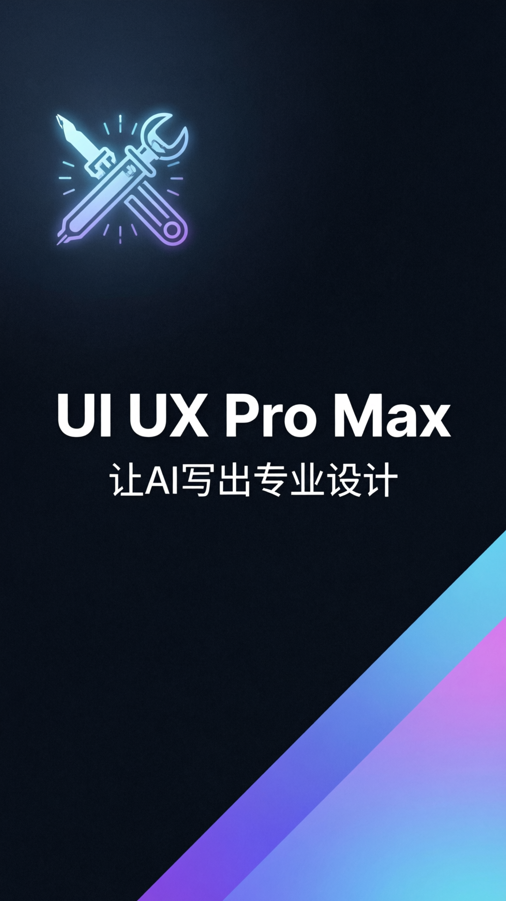

# UI UX Pro Max 视频脚本

## 元数据
- **平台**: 微信视频号 / 小红书
- **时长**: 30秒
- **主题**: 科技现代风 (Tech Vision)
- **来源**: https://x.com/sitinme/status/2039156523751117146

## 小红书版本

### 标题
UI UX Pro Max 🚀 让AI写前端不再"程序员审美"！

### 正文
用AI写前端，功能没问题，但界面总是不忍直视？

配色灰蒙蒙、排版随手摆、字体永远是默认sans-serif...

装了这个 Skill 之后，Claude Code 写出来的页面终于像专业设计师出手了！

161个行业规则、67种UI风格、161套配色方案...让AI真正懂得设计。

### 标签
#ClaudeCode #AI编程 #前端设计 #UIUX #设计系统 #无代码 #效率工具 #AI前端 #程序员审美 #设计自动化

## 视频号版本

### 标题
UI UX Pro Max：让AI写出专业设计的前端！

### 描述
AI写前端总是"程序员审美"？装了这个设计系统技能包，Claude Code秒变专业设计师！161个行业规则、67种UI风格、161套配色，让AI真正懂设计。

### 话题
#AI编程 #前端设计 #ClaudeCode #UIUX #效率提升

## 封面图


## 内容插图


## 视频脚本

### 场景1: 封面 (0-3秒)
- **视觉**: 深色背景，AI封面图居中，蓝色科技感光效
- **文字**: UI UX Pro Max / 让AI写出专业设计
- **动画**: 封面图缩放入场 (scale 1.1→1), 文字淡入

### 场景2: 痛点引入 (3-8秒)
- **视觉**: 深色背景，表情图标 + 问题文字
- **文字**: 
  - AI写前端
  - 功能没问题，界面不忍直视？
  - 配色灰蒙蒙、排版随手摆、字体永远是默认sans-serif...
- **动画**: 文字从下方滑入

### 场景3: 解决方案 (8-15秒)
- **视觉**: 深色背景，灯泡图标 + 解决方案文字
- **文字**: 
  - 💡 解决方案
  - 装上 UI UX Pro Max
  - 给AI装一套 设计系统的知识库
- **动画**: 文字淡入

### 场景4: 核心数据 (15-22秒)
- **视觉**: 左侧展示AI生成的示例页面，右侧显示数据
- **文字**: 
  - **161** 行业推理规则
  - **67** UI风格
  - **161** 配色方案
  - **57** 字体搭配
- **动画**: 数据依次弹出 (数字缩放动画)

### 场景5: 安装方式 (22-27秒)
- **视觉**: 深色背景，代码风格命令展示
- **文字**: 
  ```
  /plugin marketplace add
  nextlevelbuilder/
  ui-ux-pro-max-skill
  ```
- **说明**: 支持 Claude Code、Cursor、Windsurf 等
- **动画**: 文字淡入

### 场景6: 结尾CTA (27-30秒)
- **视觉**: 深色背景，居中大字
- **文字**: 
  - 让AI写出
  - **专业设计的页面**
  - 🚀 161个行业 · 67种风格 · 无限可能
- **动画**: 整体缩放淡入
