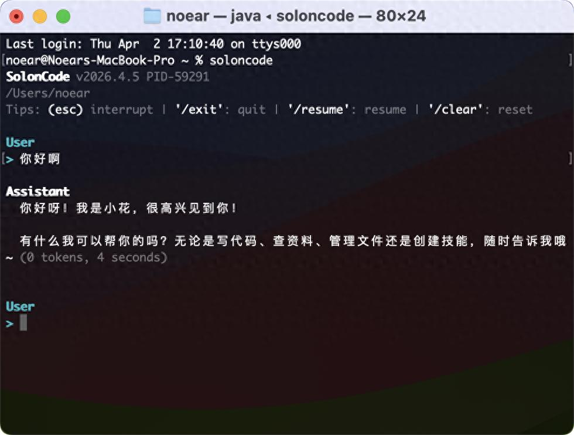

# SolonCode CLI v2026.4.5 发布（编码智能体） - 今日头条



## 1、关于 SolonCode CLI（编程终端智能体）

SolonCode CLI 是基于 Java + Solon AI 开发的 **“Claude Code” 国产开源实现版本** 。

## 常见问题：它和 Claude Code 有什么不同？

功能上很相似，关键差异：

- 采用 Java 实现，100% 开源。
- 使用“全中文”提示词构建。
- 不绑定特定提供商。需要配置模型。模型迭代会缩小差异、降低成本，因此保持 provider-agnostic 很重要。
- 聚焦终端命令行界面 (CLI)，通过系统命令运行。
- 支持 Web，ACP 协议进行远程通讯。

## 2、快速安装与开始

系统要求：

- Java 8+（支持 Java 8 到 Java 26 环境）
- 支持 macOS、Linux、Windows

安装命令（安装包自动下载约 23MB）：

```nginx
# Mac / Linux:
curl -fsSL https://solon.noear.org/soloncode/setup.sh | bash

# Windows (PowerShell):
irm https://solon.noear.org/soloncode/setup.ps1 | iex
```

## 3、SolonCode CLI 的差异化价值

SolonCode CLI 选择用 Java 开发（支持 Java8 到 Java26 环境运行），带来了独特的优势：

- 企业级友好：JVM 生态成熟稳定，易于改造成其它形态的智能体，易于在服务器环境部署
- 私有化简单：一行命令即可完成安装或更新
- 资源占用低：内存占用小，启动速度快（启动内存 70Mb 左右）
- 跨语言支持：作为通用编码助手，支持任意编程语言
- 纯系统命令：可以在控制台、（任意）IDE 控制台、批处理调度中。无界面，即处处是界面
- 强沙盒模式：安全又放心

## 4、最近更新说明

- 添加 soloncode-cli pid 打印
- 添加 soloncode-cli skillhub 自动索引
- 优化 soloncode-cli edit 失败时的提示细节
- 优化 java21+ 环境，去除启动时的 System.load() 警告
- 调整 soloncode-cli 日志输出位置到.soloncode 下面（这样，不会产生多余的目录）
- 调整 soloncode-cli TODO 机制，主代理用文件模式（避免开发时冲突，或产生文件太多），次代理用内存模式。次代理定位偏临时性
- 调整 soloncode-core CLAUDE.md 文件位置到.soloncode 下面（这样，不会产生多余的文件）