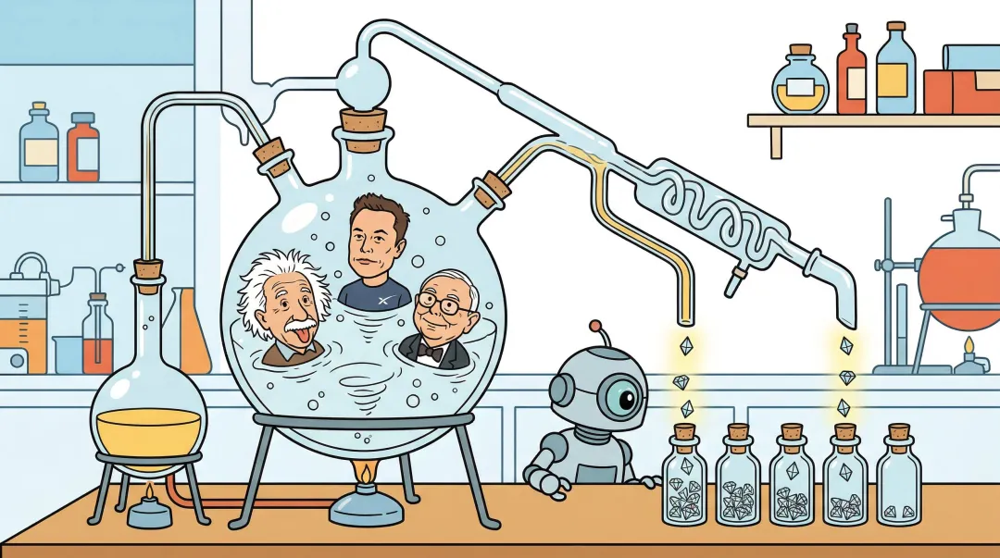
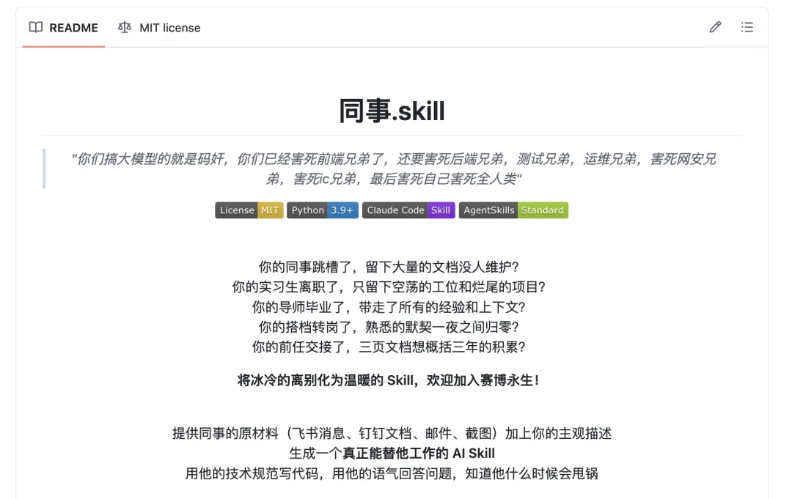
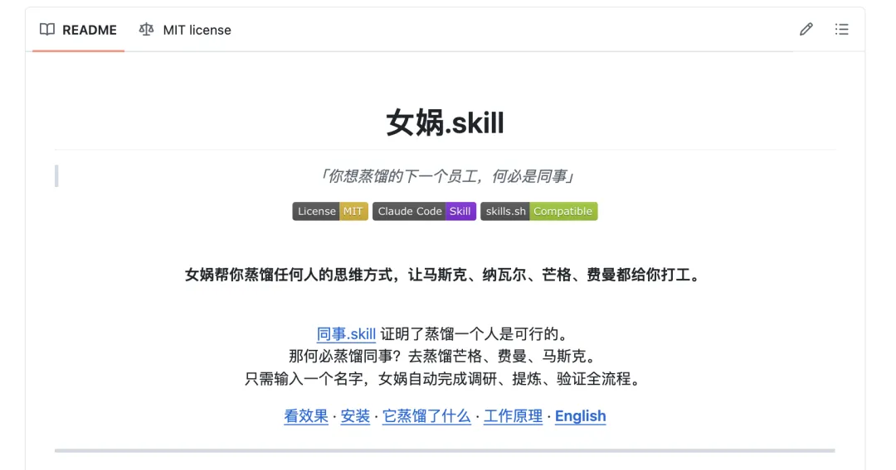
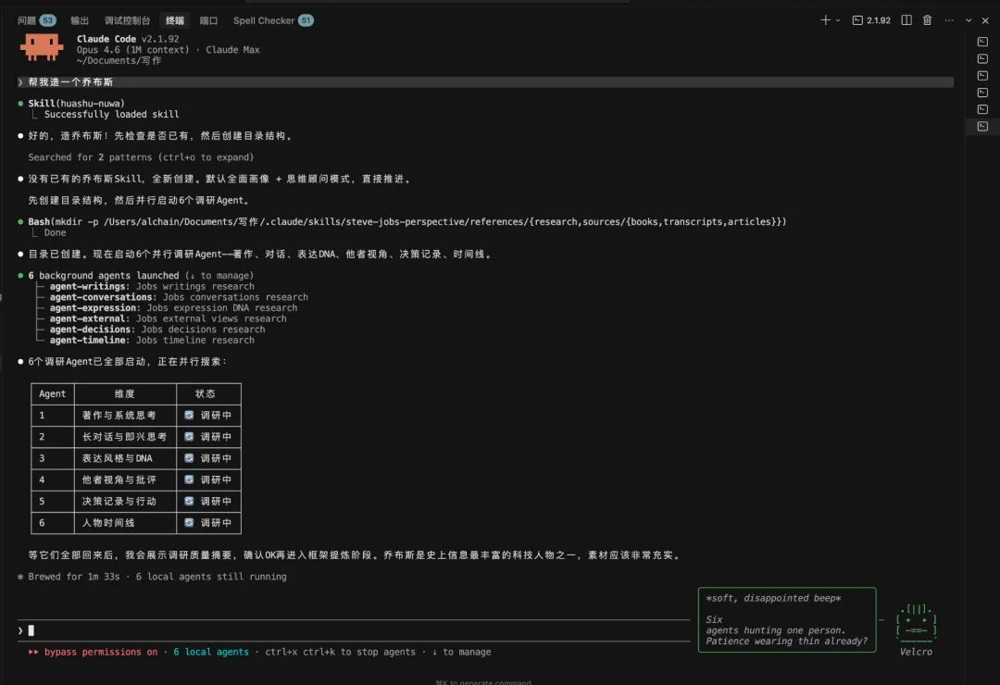
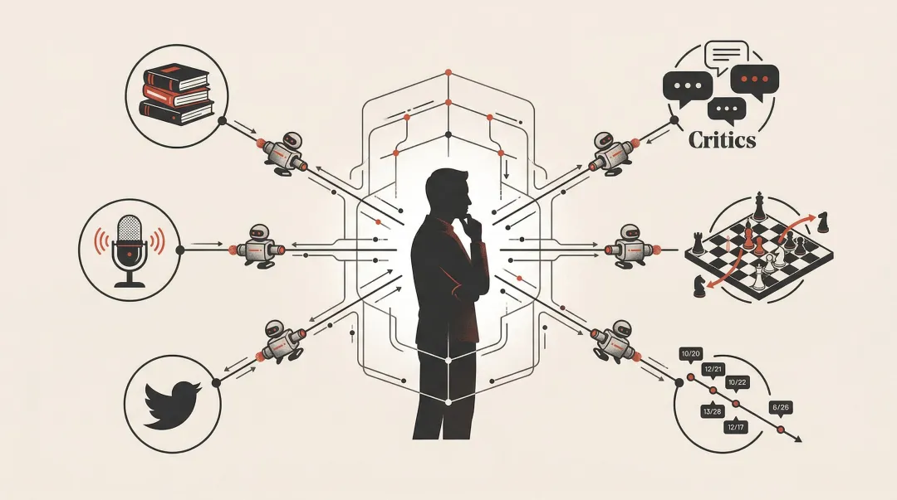
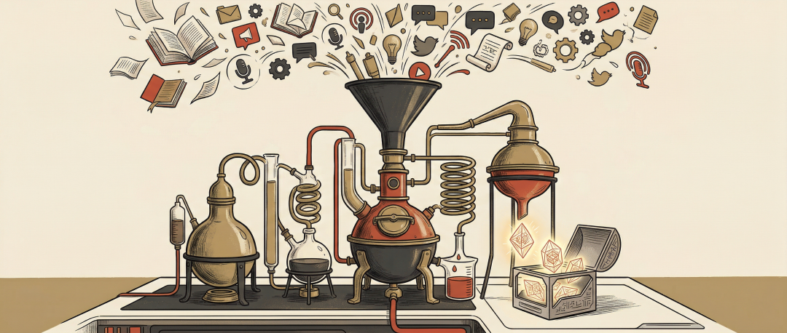
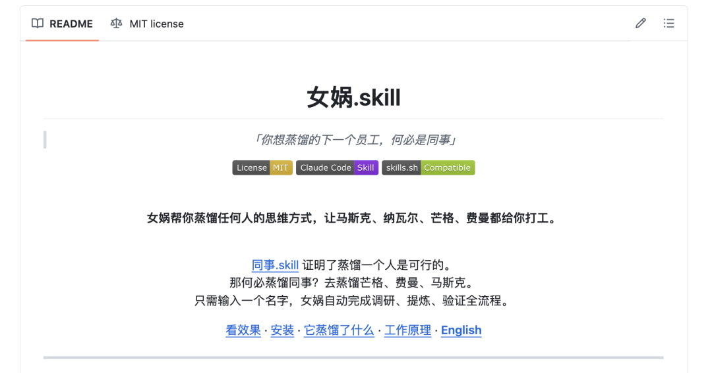

# 开源「女娲.skill」，你现在可以去蒸馏任何人！



你的下一个员工，何必是同事。

最近「同事.skill」挺火的，思路也很有意思。最近各种所谓的前任.skill，老板.skill,反蒸馏.skill这一整个蒸馏宇宙几乎都来了。

不过呢，我昨天的文章里也跟大家提了个终极的问题：既然我们已经有能力蒸馏一个人了，为什么只蒸馏同事？

同事.skill证明了一件事：把一个人的聊天记录、工作习惯、review风格、说话语气提炼成一个可运行的Skill，这条路走得通。这个能力本身很厉害。

但你想想，你身边的同事，投资比芒格厉害吗？解释复杂事物比费曼清楚吗？思考财富和自由比Naval深刻吗？

大概率不会。

那既然都有蒸馏人的能力了，**为什么不去蒸馏各领域最强的人？**

而且幸运的是，这些人通常还留下了一大堆可以被蒸馏的材料。

芒格有《穷查理宝典》、几十年的股东会发言、USC演讲。Naval有几千条推特、几十个播客、一本全球畅销的书。费曼有物理讲义、BBC访谈、自传。塔勒布有五卷本「不确定性」系列。马斯克有传记、法庭证词、无数播客。

全是公开的。全可以被蒸馏。

这等于给自己加了一排最强外援。你不可能在每个领域都成为专家，但你可以把每个领域最强的人的思维方式变成自己的工具。

其实我之前就一直在干这件事。我的Claude Code里跑着几十个Skill，其中有一类叫「视角Skill」，就是把一个人的思维方式提炼成可运行的框架。芒格、费曼、Naval、塔勒布，都蒸馏过。

上一篇「把同事作为Skill」里我说了一句：「如果蒸馏真这么有效，为什么没人去蒸馏马斯克？」

我蒸馏过。今天把方法论开源了。

## 女娲.skill

我一步到位，给这个蒸馏宇宙造了个神，他叫「女娲.skill」。

我现在已经用女娲造出了10多个我感兴趣的人的skill，下面看看效果👇

我出了几本免费的AI编程电子书，下载量很大但不赚钱。有人说我应该收费。我把这个问题丢给蒸馏后的Naval：

```
用户: 我出了几本免费电子书，下载量很大，但不赚钱。     有人说我应该收费，有人说免费才能做影响力。怎么选？Naval: 这不是免费vs收费的问题。这是你在玩哪个游戏的问题。      收费是一次性交易。卖一本赚50块，卖1000本赚5万，      然后结束了。免费是信任的复利。一个人免费读了你的书，      觉得你靠谱，然后买你的App、看你的视频、接受你的推荐      ——这条链路的终身价值远超50块。      但免费有一个前提：你得有东西在后面接住这些信任。      书免费，让它成为你整个系统的入口，而不是终点。
```

再看蒸馏马斯克之后。我不会写代码，所有产品都是AI写的，经常有人质疑这算不算真正的开发者。丢给马斯克：

```
用户: 我不会写代码，全靠AI开发，App做到了付费榜第一。     有人质疑这不算真正的开发者。你怎么看？马斯克: 这个问题本身就很蠢。我直说了。       谁规定开发者必须手写代码？回到第一性原理：开发的本质       是什么？是把一个问题变成一个可运行的解决方案。代码是       手段，不是目的。就像我不会亲手焊火箭的每一个零件，       但没人质疑SpaceX是我造的。       App Store付费榜第一——这是市场给你的答案。用户付钱       是因为你的产品解决了他们的问题，他们不关心代码是人写的       还是AI写的。
```

再来一个大家更熟悉的。蒸馏张雪峰之后：

```
用户: 家里条件一般，孩子想学金融，去不了顶尖学校，该不该报？张雪峰: 千万别报。我说过多少遍了，金融不是你学出来的，金融是       你爹妈给你带出来的。顶尖学校的金融，人家同学是行长的       儿子、基金经理的女儿，人脉就是资源。你普通家庭去个普通       学校学金融，毕业出来干什么？卖保险、跑银行柜台、做电销。       先谋生再谋爱，家里没矿就选技术类专业，学个硬本事，靠       自己吃饭。金融这碗饭，不是谁都端得起的。
```

这三段你有没有发现，还真挺像那么回事，确实是我预期这三个人可能会给我提供的回答。

所以，这到底是咋做到的？

## 蒸馏最强的人，需要提取思维框架

蒸馏同事的时候，提取行为习惯就够了。他怎么review代码、怎么写周报、怎么回消息，这些是可操作的。

但蒸馏芒格、费曼这种人的时候，光提取行为没什么意义。你不需要知道芒格几点起床、用什么软件。你需要的是他看问题的方式。

因为这些人真正厉害的不是工作习惯，是他们的**认知框架**。

而且使用极其简单。你只需要输入一个名字，女娲自动启动6个Agent去找书、找播客、找推文、找批评者，自己组织信息、自己做验证。不需要你准备任何材料。

所以女娲在蒸馏时拆的是更深的结构：

|  |
行为蒸馏

 |

思维蒸馏

 |
| --- | --- | --- |
| **做什么**

（工作习惯、流程）

 |

✅

 |

—

 |
| **怎么说话**

（语气、口癖）

 |

✅

 |

✅ 表达DNA

 |
| **怎么想**

（心智模型、认知框架）

 |

—

 |

✅

 |
| **怎么判断**

（决策启发式）

 |

—

 |

✅

 |
| **什么不做**

（反模式、价值观底线）

 |

—

 |

✅

 |
| **知道局限**

（诚实边界）

 |

—

 |

✅

 |

**心智模型**就是一个人用什么镜片看世界。芒格看什么问题都先想「反过来会怎样」，马斯克看什么东西都先算「物理极限是多少，现在离极限差几倍」。这些不是金句，是镜片。戴上不同的镜片，同一件事看到完全不同的东西。

**决策启发式**是做判断时的快速规则。Naval说「如果你在两个选项之间犹豫不决，选短期更痛苦的那个」。塔勒布说「如果一个建议者自己不承担后果，忽略他的建议」。这些规则可以直接拿来用。

**表达DNA**不是模仿他怎么说话，是理解他为什么用这种方式表达。费曼为什么总用类比？因为他真信「如果你不能简单地解释一件事，说明你没有真正理解它」。表达方式和思维方式是一体的。

## 6个Agent并行跑40多个信息源



说说怎么做到的。

女娲启动后会并行派出6个Agent，每个负责一个信息维度：

第一个查著作和长文。找的是反复出现的核心论点。一个人在三个不同场合说了同一件事，那大概率是真信念，不是场面话。

第二个查长对话和访谈。最有价值的不是回答本身，是被追问时的反应。即兴回答的质量，比准备好的演讲更能揭示真实的思维过程。

第三个查碎片表达。推特、短文、跟人吵架时的说法。这些暴露的是表达DNA。

剩下三个分别查外部视角（批评者怎么说他）、决策记录（不看他说了什么，看他做了什么）、人生时间线（特别是最近12个月的动态，因为人是会变的）。

6个Agent跑完汇总，进入提炼阶段。提炼的核心是三重验证。**一个观点要被认定为心智模型，不能只是这个人说过一次。** 它必须满足三个条件：

**跨域复现**：至少在两个不同领域出现过。芒格在投资和教育里都用逆向思维，那这是真模型。

**有生成力**：能用来推断这个人对新问题的态度。如果一个观点只能解释过去，不能预测未来，它就不是心智模型。

**有排他性**：不是所有聪明人都会这么想。「要做好准备」不是心智模型，「反脆弱」才是。

三个都满足才收录。只满足一个降级为决策启发式。一个都不满足不收录。

这套筛选把Naval的上千条推文和几十个小时的播客，压缩成了5个心智模型和8条决策启发式。

我不会写代码。女娲本身是AI写的。但设计这套蒸馏方法论的过程，是我自己一步步试出来的。

## 做不到的事，必须说清楚

**蒸馏不了直觉。** 马斯克面对从没见过的工程问题时那种「我觉得这个方向是对的」，这个不在文字里。女娲能捕捉他的分析框架，但框架跑完之后他的直觉判断，捕捉不了。

**捕捉不了突变。** 如果一个人明天突然改变了核心信念，Skill不会自动更新。造出来的是截止到调研时间点的快照。

**公开表达不等于真实想法。** 一个人在播客里说的话，和他真正做决策时的想法，可能有差距。

所以每个Skill的末尾都有一个「诚实边界」section，列出做不到什么。**一个不告诉你局限在哪的Skill，不值得信任。**

上一篇文章我说「写不进SKILL.md里的部分，才是你真正的护城河」。这句话我依然同意。直觉和创造力蒸馏不了，护城河确实存在。但女娲把能蒸馏的部分从行为推进到了思维框架，这一步的价值比听起来的大得多。

## 不是复制人，是获得智囊团


很多人对「蒸馏」这个词有误解。

我不需要一个假的芒格。我需要的是，做判断的时候能快速切换到芒格的视角看一眼。

这就像你读完芒格的书，内化了他的逆向思维，以后遇到问题会不自觉地想「反过来呢？」。女娲做的事情跟读书本质一样，只不过它帮你把几十万字的材料压缩成一个随时能对话的框架。以前是「读过，有点印象」，现在是「输入问题，直接用他的视角分析」。

我现在的工作方式：写文章问费曼「这个概念你能用类比解释吗」，做产品决策问Naval「这件事有杠杆吗」，评估风险问塔勒布「最坏情况我能承受吗」。

你读一本芒格的书可能需要一周。女娲从40多个信息源提炼一个人，大约2-3个小时。产出的不是读书笔记，是一个可以对话、可以推理、可以应用到你具体问题上的思维框架。

**每个人都值得有自己的智囊团。**

想蒸馏谁就蒸馏谁。你崇拜的作者、影响过你的导师、你想理解的对手。别局限在身边那几个同事了。芒格、费曼、马斯克、Naval、塔勒布，这些人留下的公开材料比你任何一个同事的聊天记录丰富一百倍。

决策前问芒格，写教程问费曼，评估风险问塔勒布，审视论证问道金斯。

你的下一个员工，何必是同事。

## 开源了



GitHub: https://github.com/alchaincyf/nuwa-skill

安装：`npx skills add alchaincyf/nuwa-skill`

装完之后在Claude Code里说「帮我造一个XX的skill」就行。

开源是因为我觉得这个东西不应该只有我能用。每个skill的references目录里有完整的调研文件，怎么收集、怎么筛选、怎么变成心智模型。全透明。

## 理解他人也变成了工程问题

上一篇的结尾，我说「认识你自己」从哲学问题变成了工程问题。

这一篇的结论是：「理解他人」也是。

6个维度采集信息，三重验证提炼模型。不完美，有局限，但可操作、可迭代。

你通过理解别人的思维方式，照见自己的盲点。你用芒格的逆向思维看一遍自己的决策，看到的不是芒格，是你自己的思维漏洞。

女娲造的不是人。**是镜子。**