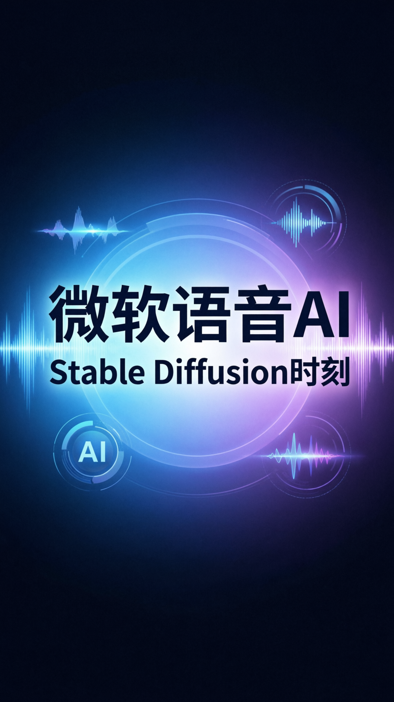

# 视频标题
微软语音 AI 迎来 "Stable Diffusion 时刻"！

## 元数据
- **平台**: 微信视频号 / 小红书
- **时长**: 约 60 秒
- **主题**: 微软语音 AI 工具 (Vibing / VibeVoice)

## 小红书版本
### 标题
微软把语音 AI 玩出"Stable Diffusion 时刻"了！😋💰

### 正文
微软又来炸场了！这次是语音 AI！

试了 Vibing 语音输入法，转录+翻译速度超快，安装包才 1.3MB，完全不需要本地模型！

更狠的是 VibeVoice：
✅ 实时 TTS，300ms 出声
✅ 90 分钟多说话人对话生成
✅ 长音频转录自动标注说话人

用它替代 ElevenLabs，省下一大笔！

#AI #语音AI #微软 #TTS #人工智能 #效率工具 #科技

### 标签
#AI语音 #微软黑科技 #Vibing #VibeVoice #TTS #人工智能 #效率提升 # ElevenLabs替代 #语音合成 #科技前沿

## 视频号版本
### 标题
微软语音 AI 爆火！300ms 出声，90 分钟对话生成！

### 描述
微软推出全新语音 AI 工具，实时 TTS 仅需 300ms，支持 90 分钟多说话人对话生成，长音频转录自动标注说话人。语音合成进入"Stable Diffusion 时刻"！

### 话题
#微软 #语音AI #人工智能 #TTS #科技

## 封面图

## 内容插图

## 视频脚本（10+ 帧场景）

### 场景 1: 封面 (0-3秒)
- **视觉**: 深色科技背景 + 动态粒子效果，中央展示标题
- **文字**: "微软语音 AI 迎来 Stable Diffusion 时刻！"
- **动画**: 标题从下方弹入，opacity 0→1，scale 0.8→1
- **字体**: 主标题 120px，副标题 48px

### 场景 2: 痛点引入 (3-8秒)
- **视觉**: 对话气泡 + 时钟图标，展示"等待"焦虑
- **文字**: "还在等语音合成慢慢出声？"
- **动画**: 问号跳动效果
- **字体**: 主文字 80px

### 场景 3: 核心数据 1 (8-14秒)
- **视觉**: 大数字动画计数效果，中央居中
- **文字**: "300ms" + "实时 TTS 出声"
- **动画**: 数字从 0 滚动到 300，绿色强调
- **字体**: 数字 180px，描述 56px

### 场景 4: 核心数据 2 (14-20秒)
- **视觉**: 时间轴动画，展示 90 分钟容量
- **文字**: "90 分钟" + "多说话人对话"
- **动画**: 时间轴从 0 延伸到 90 分钟
- **字体**: 数字 160px，描述 48px

### 场景 5: 核心数据 3 (20-26秒)
- **视觉**: 波形图 + 人形图标，展示转录标注
- **文字**: "长音频转录" + "自动标注说话人"
- **动画**: 波形逐行亮起，人形图标依次出现
- **字体**: 主文字 72px，标签 36px

### 场景 6: 功能对比 (26-34秒)
- **视觉**: 双列对比布局，左边传统方案（❌），右边 VibeVoice（✅）
- **文字**: 
  - 传统：需要本地模型 / 费用高昂 / 速度慢
  - VibeVoice：1.3MB 安装包 / 免费本地运行 / 300ms 实时
- **动画**: 左右对比依次出现
- **字体**: 标题 64px，列表 36px

### 场景 7: 使用场景 (34-42秒)
- **视觉**: 4 个场景图标网格布局
- **文字**: 
  - 🎙️ 内容创作配音
  - 🎧 有声书制作
  - 🗣️ 多语言翻译
  - 💰 节省 ElevenLabs 费用
- **动画**: 图标依次弹入
- **字体**: 场景名 48px

### 场景 8: 实时演示 (42-50秒)
- **视觉**: 模拟 TTS 界面，波形动画
- **文字**: "点击说话 → 300ms 出声"
- **动画**: 波形实时跳动效果
- **字体**: 操作提示 56px

### 场景 9: 总结呼吁 (50-56秒)
- **视觉**: 简洁居中，大字总结
- **文字**: "语音合成进入免费时代"
- **动画**: 渐入 +轻微放大
- **字体**: 主文字 96px

### 场景 10: 结尾 CTA (56-60秒)
- **视觉**: 底部关注提示 + 话题标签
- **文字**: "关注获取更多 AI 工具评测" + #微软 #语音AI #TTS
- **动画**: 底部滑入
- **字体**: CTA 64px，标签 32px

## 配色方案（科技现代风）
- **主色**: #2563EB (科技蓝)
- **辅色**: #7C3AED (电紫色)
- **强调色**: #10B981 (活力绿)
- **背景色**: #0F172A (深空黑)
- **文字色**: #F8FAFC (纯白)
