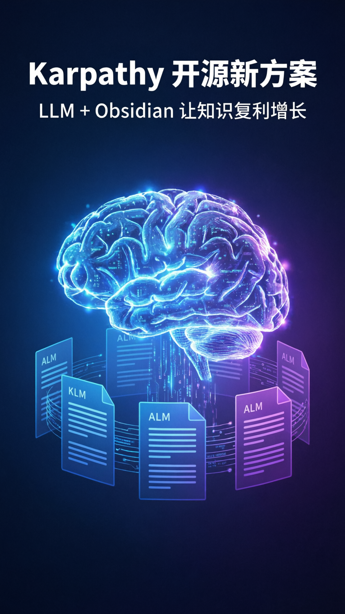

# Karpathy 知识库方案 - 视频脚本

## 元数据
- **平台**: 微信视频号 / 小红书
- **时长**: 45秒
- **主题**: 科技现代风 (Tech Vision)

## 小红书版本

### 标题
Karpathy 开源新玩法！LLM + Obsidian 让知识复利增长 🚀

### 正文
Andrej Karpathy 刚刚发布了一个新 Gist，大神都在转发！

核心思路：别把 LLM 当搜索引擎用，让它像程序员写代码一样帮你维护 Markdown 知识库。

三层架构：
🔺 Raw Sources - 原始资料，只读不写
🔺 The Wiki - LLM 生成的知识库，可复利增长
🔺 The Schema - 规则文件，持续迭代优化

三个核心操作：
✅ Ingest 录入 - LLM 增量更新 10-15 个页面
✅ Query 提问 - 综合回答可回存 Wiki
✅ Lint 体检 - 保持知识库健康

工具：Claude Code / Codex + Obsidian

不需要向量数据库，不需要复杂 RAG，直接索引文件就够用！

#AI #知识管理 #Karpathy #Obsidian #LLM #ChatGPT #Claude #效率工具 #知识库 #AGI

## 视频号版本

### 标题
Karpathy 开源 Agent + Obsidian 知识库方案

### 描述
不要把 LLM 当搜索引擎用。让它像程序员写代码一样帮你持续维护一个可复利增长的知识网络。

三层架构 + 三个核心操作，让知识真正沉淀下来。

### 话题
#AI #知识管理 #Karpathy #Obsidian #LLM

## 封面图

## 视频脚本

### 场景1: 封面 (0-3秒)
- **视觉**: 深色科技背景，中央渐变发光效果
- **文字**: "Karpathy 开源新方案"
- **副标题**: "LLM + Obsidian = 知识复利"
- **动画**: 文字从中心放大淡入，背景微光脉动

### 场景2: 问题切入 (3-8秒)
- **视觉**: 左侧问题图标，右侧痛点文字
- **文字**: "你还在这样用 LLM？"
- **内容**: "问一次答一次，答完就忘，知识从来没有沉淀"
- **动画**: 问题逐字出现，红色叉号标记

### 场景3: 核心理念 (8-14秒)
- **视觉**: 中心大字 + 两侧示意图
- **文字**: "把 LLM 当知识工程师"
- **内容**: "让它帮你把散乱信息编译成结构化知识网络"
- **动画**: 文字弹簧放大，背景线条流动

### 场景4: 三层架构 (14-22秒)
- **视觉**: 三层金字塔结构图
- **文字**: "三层架构"
- **内容**:
  - "Raw Sources 原始资料层"
  - "The Wiki 知识库层"
  - "The Schema 规则文件层"
- **动画**: 各层依次从下往上点亮

### 场景5: 三个操作 (22-32秒)
- **视觉**: 三个操作卡片并排
- **文字**: "三个核心操作"
- **内容**:
  - "Ingest - 增量录入"
  - "Query - 智能提问"
  - "Lint - 定期体检"
- **动画**: 卡片依次弹出

### 场景6: 效果展示 (32-38秒)
- **视觉**: 数据增长曲线
- **文字**: "知识复利"
- **内容**: "每加一个新来源，知识库都变得更丰富"
- **动画**: 曲线从左下向右上的动画

### 场景7: 工具推荐 (38-43秒)
- **视觉**: 工具图标展示
- **文字**: "你需要什么？"
- **内容**: "Claude Code / Codex + Obsidian"
- **动画**: 图标依次出现

### 场景8: 结尾 (43-45秒)
- **视觉**: 居中大字
- **文字**: "让知识滚雪球"
- **副标题**: " gist.github.com/karpathy/442a6bf5"
- **动画**: 淡入 + 轻微缩放
