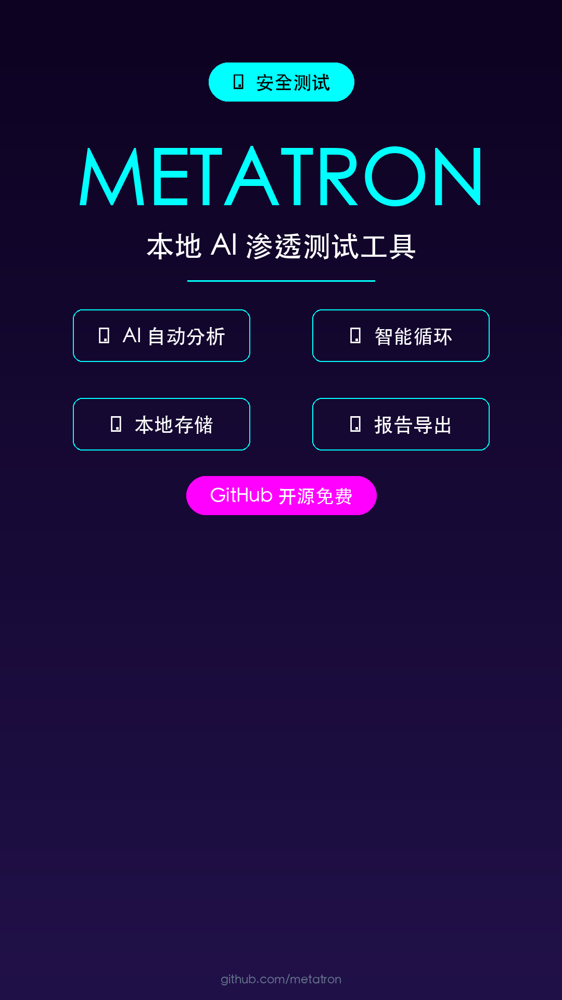

# METATRON - 本地 AI 渗透测试工具

## 元数据
- **平台**: 微信视频号 / 小红书 / 抖音
- **时长**: 40秒
- **主题**: 安全测试 / AI 工具
- **配色**: 科技现代风（深色背景 + 霓虹强调色）

## 小红书版本

### 标题
安全测试用 AI 自动化！全程离线运行 🚀

### 正文
手动跑侦察工具、分析结果找漏洞，流程繁琐还容易遗漏？

今天推荐一款开源工具 METATRON，用本地 AI 模型串起整个渗透测试流程。

输入目标 IP 或域名，自动跑 nmap、whois、nikto 等侦察工具，把结果喂给本地 AI 分析漏洞、推荐修复方案。

内置智能循环机制，AI 觉得信息不够会自动追加工具扫描。

所有记录存本地数据库，支持导出 PDF 和 HTML 报告。

如果你在学习渗透测试，或者想给服务器做安全体检，这个工具可以省不少事。

GitHub 开源免费。

### 标签
#安全测试 #渗透测试 #AI工具 #网络安全 #GitHub #开源 #信息安全 #KaliLinux #漏洞扫描 #白帽黑客

## 视频号版本

### 标题
用 AI 自动化安全测试！全程离线，不依赖云服务

### 描述
METATRON 是一款本地 AI 渗透测试工具，串起 nmap、whois、nikto 等侦察工具，自动分析漏洞、推荐修复方案。内置智能循环，AI 自动追踪。GitHub 开源免费。

### 话题
#网络安全 #AI工具 #渗透测试 #开源

## 封面图


## 视频脚本

### 场景1: 封面 (0-5秒)
- **视觉**: 深色背景，科技感渐变，中心展示 Logo 和主标题
- **文字**: METATRON（大字）+ 本地 AI 渗透测试（小字）
- **动画**: 淡入 + 轻微缩放
- **背景色**: #0D0221（深紫黑）

### 场景2: 痛点 (5-12秒)
- **视觉**: 深色背景，单条大字体居中
- **文字**: "手动跑侦察工具，流程繁琐还容易遗漏"
- **动画**: 逐字出现效果
- **背景色**: #0D0221

### 场景3: 解决方案介绍 (12-20秒)
- **视觉**: 4个功能卡片网格布局
- **内容**:
  - 🤖 AI 自动分析 - 输入目标，自动跑工具并分析漏洞
  - 🔄 智能循环 - 信息不足时自动追加工具扫描
  - 💾 本地存储 - 所有记录存在本地数据库
  - 📊 报告导出 - 一键导出 PDF 和 HTML
- **动画**: 卡片依次淡入

### 场景4: 核心能力 (20-30秒)
- **视觉**: 居中大字体 + 底部工具列表
- **内容**:
  - 主标题: "全程离线运行，不依赖任何云服务"
  - 工具: nmap · whois · nikto · 本地 AI
- **动画**: 工具图标依次出现

### 场景5: 结尾 (30-40秒)
- **视觉**: 居中大字体 + GitHub 信息
- **内容**:
  - 主标题: "GitHub 开源免费"
  - 副标题: "渗透测试 · 安全体检 · 学习研究"
- **动画**: 淡入效果

## 配音文案

```
今天给大家介绍一款安全测试神器：METATRON。

做安全测试时，手动跑侦察工具，再自己分析结果找漏洞，流程繁琐还容易遗漏。

METATRON 用本地 AI 模型串起整个渗透测试流程，输入目标 IP 或域名，它自动跑 nmap、whois、nikto 等侦察工具，再把结果喂给本地 AI 分析漏洞、推荐修复方案。

内置智能循环机制，AI 分析过程中如果觉得信息不够，会自动追加工具扫描。

所有扫描记录都存在本地数据库，还能一键导出 PDF 和 HTML 报告。

如果你在学习渗透测试，或者想给自己的服务器做个安全体检，这个工具可以省不少事。

GitHub 开源免费。
```

## 技术规格

| 项目 | 值 |
|------|-----|
| 分辨率 | 1080×1920 (竖屏) |
| 帧率 | 60fps |
| 时长 | 40秒 |
| 码率 | 8-12 Mbps |
| 音频 | AAC 256kbps |
