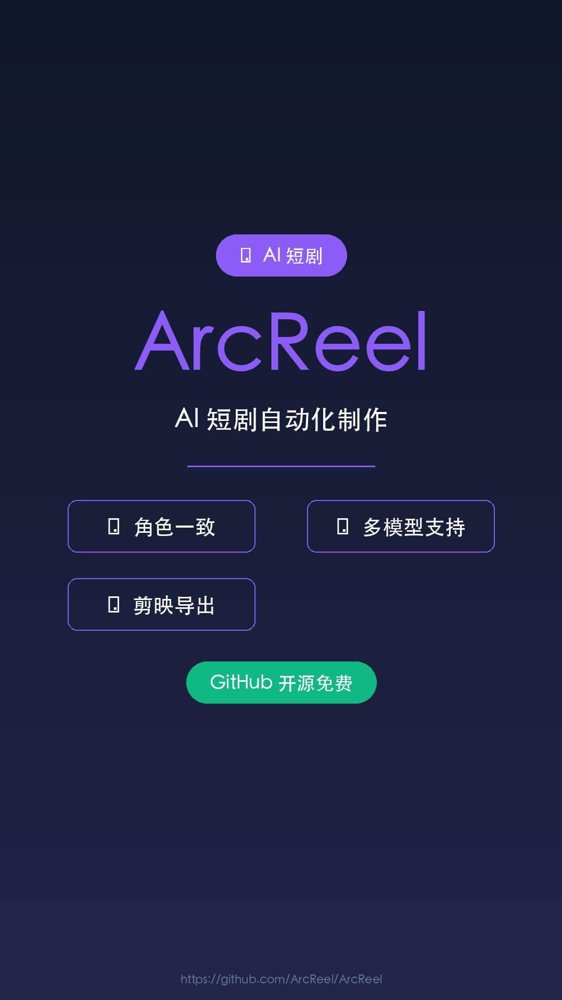

# ArcReel - AI 短剧自动化制作工具

## 元数据
- **平台**: 微信视频号 / 小红书 / 抖音
- **时长**: 40秒
- **主题**: AI 视频创作 / 短剧制作
- **配色**: 科技现代风（深色背景 + 紫色强调）

## 小红书版本

### 标题
AI 短剧一键生成！从小说到成片全程自动 🚀

### 正文
AI 短剧赛道爆火，想动手却发现剧本拆分、角色设计、生图、生视频需要在好几个工具之间切换，极其消耗精力。

今天发现一款开源项目 ArcReel，把从小说到成片的整个流程串成了一条自动化流水线。

只需上传小说内容，AI 自动完成剧本生成、角色设计、分镜绘制、视频片段生成，最后合成完整视频，基本不用手动干预。

它会先生成角色设计图，后续所有画面都参考这张图，保证同一个角色在不同镜头里长得一样。

支持 Gemini、Grok、OpenAI 等主流模型，随时切换。

做完的视频片段还能一键导出成剪映草稿，方便二次编辑。

如果你也想制作 AI 短剧，ArcReel 可以帮你省大量精力。

GitHub 开源免费。

### 标签
#AI短剧 #AI视频 #ArcReel #人工智能 #视频制作 #AIGC #短剧创作 #影视制作 #开源工具 #Gemini

## 视频号版本

### 标题
从小说到成片！AI 短剧自动化制作工具

### 描述
ArcReel 把从小说到成片的流程串成自动化流水线，上传小说，AI 自动完成剧本生成、角色设计、分镜绘制、视频片段生成。支持 Gemini、Grok、OpenAI，一键导出剪映草稿。GitHub 开源免费。

### 话题
#AI #视频制作 #人工智能 #开源 #短剧

## 封面图


## 视频脚本

### 场景1: 封面 (0-5秒)
- **视觉**: 深色背景，科技感渐变，中心展示 Logo 和主标题
- **文字**: ArcReel（大字）+ AI 短剧自动化制作（小字）
- **动画**: 淡入 + 轻微缩放
- **背景色**: #0F172A

### 场景2: 痛点 (5-12秒)
- **视觉**: 深色背景，单条大字体居中
- **文字**: "AI 短剧赛道爆火，想动手却发现..."
- **副文字**: "剧本拆分 · 角色设计 · 生图 · 生视频"
- **动画**: 逐字出现效果

### 场景3: 解决方案 (12-20秒)
- **视觉**: 流程图样式，展示自动化流水线
- **内容**:
  - 上传小说 → 剧本生成 → 角色设计 → 分镜绘制 → 视频片段 → 合成成片
- **动画**: 流程依次亮起

### 场景4: 核心功能 (20-30秒)
- **视觉**: 3个功能卡片
- **内容**:
  - 🎭 角色一致性 - 同一角色不同镜头长得一样
  - 🔄 多模型支持 - Gemini / Grok / OpenAI 随时切换
  - ✂️ 剪映导出 - 一键导出剪映草稿

### 场景5: 结尾 (30-40秒)
- **视觉**: 居中大字体 + GitHub 信息
- **内容**:
  - 主标题: "GitHub 开源免费"
  - 副标题: "AI 短剧 · 从小说到成片"
- **动画**: 淡入效果

## 配音文案

```
今天给大家介绍一款 AI 短剧制作神器：ArcReel。

AI 短剧赛道爆火，想动手却发现剧本拆分、角色设计、生图、生视频这些环节，需要在好几个工具之间切换，极其消耗精力。

ArcReel 把从小说到成片的整个流程串成了一条自动化流水线，只需上传小说内容，AI 便自动完成剧本生成、角色设计、分镜绘制、视频片段生成，最后合成完整视频。

它会先生成角色设计图，后续所有画面都参考这张图，保证同一个角色在不同镜头里长得一样。

图片和视频生成支持 Gemini、Grok、OpenAI 等主流模型，随时切换。

做完的视频片段还能一键导出成剪映草稿，方便二次编辑调整。

如果你也想制作 AI 短剧，ArcReel 可以帮你省大量精力。

GitHub 开源免费。
```

## 技术规格

| 项目 | 值 |
|------|-----|
| 分辨率 | 1080×1920 (竖屏) |
| 帧率 | 60fps |
| 时长 | 40秒 |
| 码率 | 8-12 Mbps |
| 音频 | AAC 256kbps |
