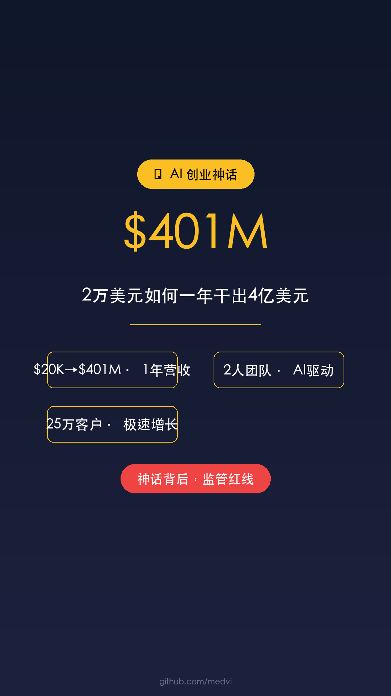

# Medvi - AI 一人独角兽神话

## 元数据
- **平台**: 微信视频号 / 小红书 / 抖音
- **时长**: 40秒
- **主题**: AI 创业 / 商业故事
- **配色**: 科技现代风（深色背景 + 金色强调）

## 小红书版本

### 标题
2万美元如何一年干出4亿美元？AI一人公司神话 ⚡

### 正文
2万美元启动，1年干出4亿美元营收、6500万美元净利润。

这不是神话，是真实发生的AI创业故事。

41岁的Matthew Gallagher在2024年9月，靠着ChatGPT、Claude、Midjourney等AI工具快速上线项目，主打GLP-1减肥药复合调配。

整个公司只有他和弟弟两个全职员工，其余医生、处方、药房、物流全部靠白标平台打包提供。

2025年业绩：
- 营收：4.01亿美元
- 客户：25万
- 净利润率：16.2%

但这神话背后，也踩满了监管红线。

想了解更多 AI 创业故事？

### 标签
#AI创业 #一人公司 #独角兽 #Medvi #商业故事 #创业神话 #AI工具 #GLP1 #减肥药 #创业

## 视频号版本

### 标题
2万美元一年干出4亿美元！AI一人公司神话

### 描述
41岁男子用2万美元和AI工具，1年干出4亿美元营收。但神话背后也踩满了监管红线。这是一个关于AI效率和创业风险的完整故事。

### 话题
#AI #创业 #独角兽 #商业故事 #Medvi

## 封面图


## 视频脚本

### 场景1: 封面 (0-5秒)
- **视觉**: 深色背景，金色渐变，中心展示数字和标题
- **文字**: $4亿 + 标题 + 副标题
- **动画**: 淡入 + 轻微缩放
- **背景色**: #0F172A

### 场景2: 震撼数据 (5-12秒)
- **视觉**: 大数字居中展示
- **内容**:
  - $20K → $401M
  - 2人公司
  - 25万客户
- **动画**: 数字跳动效果

### 场景3: 商业模式 (12-20秒)
- **视觉**: 流程/架构展示
- **内容**:
  - AI工具：ChatGPT + Claude + Midjourney
  - 白标平台：医生+处方+药房+物流
  - 2人全职团队

### 场景4: 高速增长 (20-30秒)
- **视觉**: 增长数据展示
- **内容**:
  - 2025年：4.01亿美元营收
  - 净利润率：16.2%
  - 2026年预计：18亿美元

### 场景5: 结尾 (30-40秒)
- **视觉**: 居中警示语
- **内容**:
  - 主标题: "神话背后，监管红线"
  - 副标题: "AI效率奇迹 ≠ 合规经营"

## 配音文案

```
今天给大家讲一个真实的AI创业神话。

2万美元启动，一年干出4亿美元营收、6500万美元净利润。

41岁的Matthew Gallagher在2024年9月，靠着ChatGPT、Claude、Midjourney等AI工具快速上线项目，主打GLP-1减肥药。

整个公司只有他和弟弟两个全职员工，其余医生、处方、药房、物流，全部靠白标平台打包提供。

2025年，Medvi拿下4.01亿美元营收，服务25万客户，净利润率16.2%。

但这神话背后，也踩满了监管红线。

用AI工具加上白标平台，看似合法的创业模式，却始终游走在FDA监管的边缘。

AI能放大效率，但不能替代合规。
```

## 技术规格

| 项目 | 值 |
|------|-----|
| 分辨率 | 1080×1920 (竖屏) |
| 帧率 | 60fps |
| 时长 | 40秒 |
| 码率 | 8-12 Mbps |
| 音频 | AAC 256kbps |
