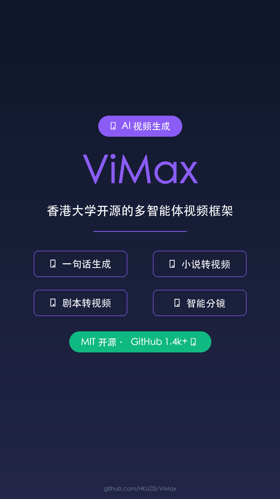

# ViMax - 香港大学 AI 视频生成框架

## 元数据
- **平台**: 微信视频号 / 小红书 / 抖音
- **时长**: 40秒
- **主题**: AI 视频生成 / 多智能体框架
- **配色**: 科技现代风（深色背景 + 紫色强调）

## 小红书版本

### 标题
港大开源 ViMax！一句话生成完整短剧 🚀

### 正文
输入一句话，AI 就能为你拍出一部完整的短剧？

香港大学数据科学实验室开源了 ViMax 框架，整合导演、编剧、制片人功能，通过多智能体协作实现"自编自导自演"。

支持四种模式：
- Idea2Video：一句话生成视频
- Novel2Video：小说转视频
- Script2Video：剧本转视频
- AutoCameo：智能分镜生成

解决 AI 视频生成的三大痛点：
- 片段短 → 分钟级长视频
- 一致性差 → 角色和场景保持一致
- 缺乏叙事深度 → 完整故事线

整合 Google Veo、豆包 Seedance 等主流模型，MIT 开源协议。

GitHub 已获得 1.4k+ 星标。

### 标签
#ViMax #AI视频 #香港大学 #多智能体 #视频生成 #开源 #人工智能 #HKUDS #AIGC #导演

## 视频号版本

### 标题
输入一句话，AI 自编自导自演完整短剧！

### 描述
香港大学开源 ViMax 多智能体视频生成框架，整合导演、编剧、制片人功能，支持从创意、小说到剧本的多种输入形式，自动生成分钟级长视频并保持角色场景一致。MIT 开源协议。

### 话题
#AI #视频生成 #香港大学 #开源 #人工智能

## 封面图


## 视频脚本

### 场景1: 封面 (0-5秒)
- **视觉**: 深色背景，科技感渐变，中心展示 Logo 和主标题
- **文字**: ViMax（大字）+ 香港大学 AI 视频生成（小字）
- **动画**: 淡入 + 轻微缩放
- **背景色**: #0F172A

### 场景2: 痛点 (5-12秒)
- **视觉**: 深色背景，3个痛点列表
- **内容**:
  - ❌ 片段短 - 当前 AI 视频只能生成几秒
  - ❌ 一致性差 - 角色和场景不连贯
  - ❌ 缺叙事 - 没有完整故事线
- **动画**: 逐个淡入效果

### 场景3: 解决方案 (12-20秒)
- **视觉**: 流程图样式，展示多智能体协作
- **内容**:
  - 导演 Agent → 编剧 Agent → 制片人 Agent → 视频生成
- **动画**: 流程依次亮起

### 场景4: 四大模式 (20-30秒)
- **视觉**: 4个模式卡片
- **内容**:
  - 💡 Idea2Video - 一句话生成视频
  - 📚 Novel2Video - 小说转视频
  - 🎬 Script2Video - 剧本转视频
  - 🎭 AutoCameo - 智能分镜生成

### 场景5: 结尾 (30-40秒)
- **视觉**: 居中大字体 + GitHub 信息
- **内容**:
  - 主标题: "MIT 开源协议"
  - 副标题: "GitHub 1.4k+ ⭐"
  - 底部: github.com/HKUDS/ViMax
- **动画**: 淡入效果

## 配音文案

```
今天给大家介绍一款香港大学开源的视频生成神器：ViMax。

输入一句话，AI 就能为你拍出一部完整的短剧？

ViMax 是香港大学数据科学实验室推出的多智能体视频生成框架，整合导演、编剧、制片人功能，通过多智能体协作实现真正的自编自导自演。

它解决了当前 AI 视频生成的三大痛点：

第一，片段短。ViMax 能生成分钟级长视频，不再是几秒钟的片段。

第二，一致性差。它能保持角色和场景的一致性，让整个视频连贯自然。

第三，缺乏叙事深度。ViMax 内置完整的故事线生成，从创意到成片有完整的叙事逻辑。

支持四种模式：Idea2Video，一句话生成视频；Novel2Video，小说转视频；Script2Video，剧本转视频；AutoCameo，智能分镜生成。

整合 Google Veo、豆包 Seedance 等主流视频生成模型。

MIT 开源协议，GitHub 已获得 1.4k+ 星标。

如果你想制作 AI 短剧，ViMax 值得一试。
```

## 技术规格

| 项目 | 值 |
|------|-----|
| 分辨率 | 1080×1920 (竖屏) |
| 帧率 | 60fps |
| 时长 | 40秒 |
| 码率 | 8-12 Mbps |
| 音频 | AAC 256kbps |
