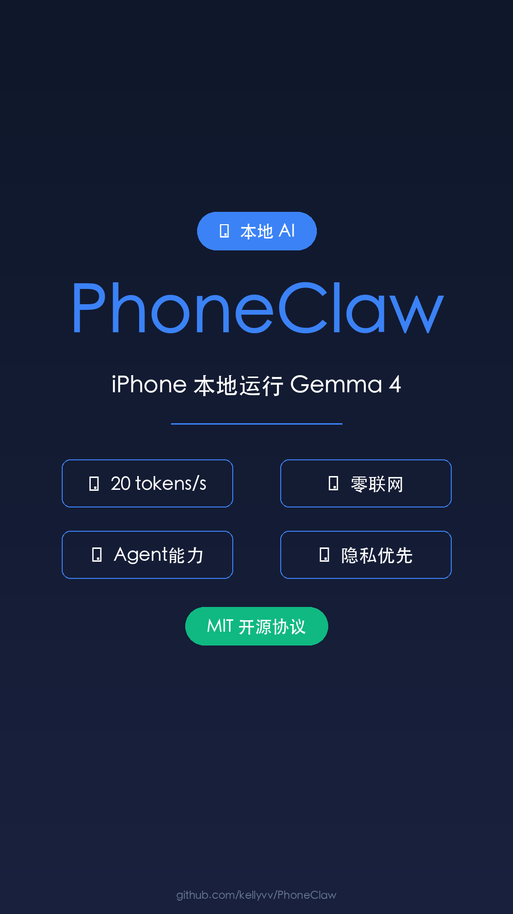

# PhoneClaw - iPhone 本地运行 Gemma 4

## 元数据
- **平台**: 微信视频号 / 小红书 / 抖音
- **时长**: 40秒
- **主题**: 移动端 AI / 本地推理
- **配色**: 科技现代风（深色背景 + 蓝色强调）

## 小红书版本

### 标题
iPhone 本地跑 Gemma 4 了！20 tokens/s 零联网 🔥

### 正文
重磅！iPhone 上完全本地跑通 Google Gemma 4 了！

@kellyv_ai 开发的 PhoneClaw 实现离线运行 Google Gemma 4，速度最高 20 tokens/s！

支持设备信息、剪贴板、文本工具等多项 Skills，真正 Agent 能力，飞行模式也能用。

隐私第一，零联网。移动端本地 AI 新时代来了！

项目已开源 MIT 协议。

### 标签
#Gemma4 #iPhone #本地AI #PhoneClaw #移动端 #OnDeviceAI #Google #开源 #人工智能 #离线运行

## 视频号版本

### 标题
iPhone 本地跑 AI 大模型！20 tokens/s 零联网

### 描述
PhoneClaw 让 Google Gemma 4 在 iPhone 上完全本地运行，离线推理速度最高 20 tokens/s。支持 Skills、真正 Agent 能力、隐私优先。MIT 开源协议。

### 话题
#AI #iPhone #Gemma4 #开源 #移动端

## 封面图


## 视频脚本

### 场景1: 封面 (0-5秒)
- **视觉**: 深色背景，科技感渐变，中心展示 Logo
- **文字**: PhoneClaw（大字）+ iPhone 本地 AI（小字）
- **动画**: 淡入 + 轻微缩放
- **背景色**: #0F172A

### 场景2: 核心亮点 (5-12秒)
- **视觉**: 3个亮点卡片
- **内容**:
  - ⚡ 20 tokens/s - 本地推理速度
  - 🔒 零联网 - 完全离线运行
  - 🤖 Agent 能力 - 飞行模式也能用

### 场景3: 技术细节 (12-20秒)
- **视觉**: 架构或流程展示
- **内容**:
  - Gemma 4 (E4B & E2B 量化版)
  - iPhone 本地推理
  - Skills 支持

### 场景4: 应用场景 (20-30秒)
- **视觉**: 3个应用场景
- **内容**:
  - 📱 隐私优先 - 数据不离开设备
  - ✈️ 离线可用 - 飞行模式也能用
  - 🔧 Skills - 设备信息、剪贴板、文本

### 场景5: 结尾 (30-40秒)
- **视觉**: 居中大字体 + 开源信息
- **内容**:
  - 主标题: "MIT 开源协议"
  - 副标题: "移动端本地 AI 新时代"
- **动画**: 淡入效果

## 配音文案

```
今天给大家介绍一个重磅开源项目：PhoneClaw。

iPhone 上完全本地跑通 Google Gemma 4 了！

@kellyv_ai 开发的 PhoneClaw 实现离线运行 Gemma 4，速度最高达到 20 tokens/s。

支持设备信息、剪贴板、文本工具等多项 Skills，真正具备 Agent 能力，飞行模式也能用。

隐私第一，零联网。所有数据都在本地处理，不上传任何服务器。

Gemma 4 的 E4B 和 E2B 量化版都已调通，在 iPhone 上实现高效本地推理。

移动端本地 AI 新时代来了！

项目已开源 MIT 协议。
```

## 技术规格

| 项目 | 值 |
|------|-----|
| 分辨率 | 1080×1920 (竖屏) |
| 帧率 | 60fps |
| 时长 | 40秒 |
| 码率 | 8-12 Mbps |
| 音频 | AAC 256kbps |
