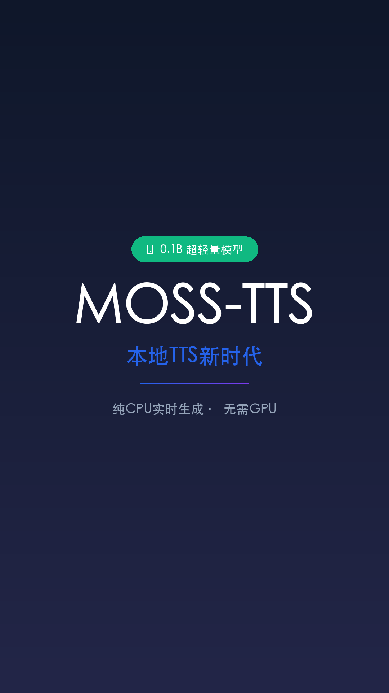

# 视频标题
MOSS-TTS-Nano 0.1B 多语言TTS本地部署神器！

## 元数据
- **平台**: 微信视频号 / 小红书 / 抖音
- **时长**: 45秒
- **主题**: 科技现代风 (Tech Vision)
- **分支**: 主推文 2043642138949570851

## 小红书版本
### 标题
🎙️ 0.1B模型本地跑TTS？兄弟们真的卷疯了！

### 正文
就在最近，ModelScope 和 OpenMOSS 联合发布了 MOSS-TTS-Nano！

0.1B 超轻量模型，纯 CPU 实时语音生成，不需要 GPU！

🔥 20种语言
🔥 48kHz 高清音质
🔥 支持语音克隆
🔥 部署简单，本地demo/网页服务/产品集成秒适配

和1.7B、8B旗舰模型完美互补，TTS全家桶安排上！

GitHub: github.com/modelscope/MOSS-TTS

### 标签
#AI #TTS #语音合成 #本地部署 #开源 #AI工具 #技术革命 #AI资讯 #模型推荐 #效率神器

## 视频号版本
### 标题
0.1B模型本地跑TTS？ModelScope开源新品炸场！

### 描述
ModelScope 和 OpenMOSS 发布 MOSS-TTS-Nano，0.1B超轻量模型，纯CPU实时生成，20语言+48kHz音质+语音克隆，开源免费！

### 话题
#AI #TTS #开源 #ModelScope #语音合成 #技术资讯

## 封面图

## 视频脚本
### 场景1: 封面 (0-3秒)
- 视觉: 深色科技风背景，大字体标题居中，渐变光效
- 文字: "0.1B 模型本地跑 TTS"
- 动画: 标题从下方弹入，scale 0.8→1.0，opacity 0→1

### 场景2: 核心亮点 (3-12秒)
- 视觉: 四个功能卡片依次展示
- 文字: 
  - "纯 CPU 实时生成 · 无需 GPU"
  - "20 种语言 + 48kHz 音质"
  - "语音克隆直接起飞"
  - "部署简单 本地/网页/产品全适配"
- 动画: 每张卡片间隔1.5秒入场

### 场景3: 旗舰对比 (12-20秒)
- 视觉: 三款模型对比展示
- 文字:
  - "0.1B Nano 轻量级 · CPU实时"
  - "1.7B Mid 主流 · 性能均衡"
  - "8B Large 旗舰 · 全能王者"
- 动画: 三列卡片依次展开

### 场景4: 应用场景 (20-30秒)
- 视觉: 四个应用场景图标展示
- 文字:
  - "本地 Demo"
  - "网页服务"
  - "产品集成"
  - "语音克隆"
- 动画: 网格布局依次出现

### 场景5: 结尾 (30-40秒)
- 视觉: GitHub链接居中显示
- 文字: "GitHub: github.com/modelscope/MOSS-TTS"
- 动画: 链接淡入 + 呼吸光效

## 旁白文案
兄弟们！MOSS-TTS-Nano 0.1B 多语言TTS直接封神了！

纯CPU实时语音生成，无需GPU，部署简单到爆。

本地Demo、网页服务、轻量产品秒适配。

20种语言，48kHz Stereo音质拉满，语音克隆直接起飞！

和1.7B、8B旗舰完美互补，开源神器get！AI语音本地化时代来了！
