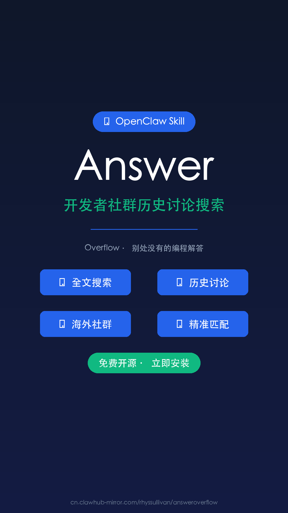

# Answer 技能视频脚本

## 元数据
- **平台**: 微信视频号 / 小红书 / YouTube
- **时长**: 54.8 秒
- **帧率**: 60fps
- **分辨率**: 1080×1920 (竖屏)
- **主题**: 科技现代风 (Tech Vision)
- **配色**: 主色#2563EB, 辅色#7C3AED, 强调色#10B981, 背景色#0F172A

---

## 配音文稿

你有没有遇到过这种情况——搜了半天编程问题，找到的全是国内论坛的过时回答，或者根本搜不到？

其实，海外开发者社区里藏着大量高质量的历史讨论，Stack Overflow、Discord、Reddit——无数程序员在上面分享过真实踩坑经验。

但问题是，这些内容散落在各个平台，语言也是英文，搜索门槛很高。

现在有了 Answer 技能，这个问题迎刃而解。

Answer 基于 AnswerOverflow，能让你用自然语言直接搜索海外开发者社群的历史讨论。

举个例子——你想知道"React hooks 在异步请求中如何正确处理竞态条件"，只需要用中文提问，Answer 就会帮你从海量历史讨论中找到最相关的答案。

它不只是搜索，而是真正理解你的编程问题，给你精准匹配的社区智慧。

那些在 Stack Overflow 上被踩了三百次、解答了一千个人的问题，就藏在那里等着你去发现。

安装也很简单，在 OpenClaw 中执行安装命令，一键搞定。

不再为找不到编程答案发愁。Answer，让全球开发者的智慧为你所用。

---

## 场景分解

### 场景1: 封面 (0-342帧 / 0-5.7秒)
- **视觉**: 深色背景 + 网格装饰，大字 "Answer" 居中，绿色副标题
- **文字**: "🛠️ OpenClaw Skill" | "Answer" | "开发者社群历史讨论搜索"
- **动画**: spring弹入 + scale放大 + 上移入场
- **配音**: 开场白

### 场景2: 痛点 (342-852帧 / 5.7-14.2秒)
- **视觉**: 三个痛点卡片逐一弹入
- **文字**: 😩搜了半天编程问题 / 📄全是过时国内回答 / ❌根本搜不到
- **动画**: 每隔20帧依次弹入
- **配音**: 痛点描述

### 场景3: 海外社区宝藏 (852-1140帧 / 14.2-19秒)
- **视觉**: 平台标签矩阵
- **文字**: Stack Overflow / Discord / Reddit / GitHub
- **动画**: 平台标签依次弹入
- **配音**: 海外社区介绍

### 场景4: Answer登场 (1140-1374帧 / 19-22.9秒)
- **视觉**: 渐变光晕聚焦，Answer大标题渐变色
- **文字**: "现在有了" | "Answer" | "这个问题迎刃而解"
- **动画**: 缩放弹入
- **配音**: Answer介绍

### 场景5: 核心功能 (1374-1758帧 / 22.9-29.3秒)
- **视觉**: 功能介绍 + 高亮卡片
- **文字**: 基于AnswerOverflow + 全文语义搜索说明
- **动画**: 淡入
- **配音**: 功能说明

### 场景6: 使用示例 (1758-2400帧 / 29.3-40秒)
- **视觉**: 问答对话框形式展示
- **文字**: React hooks问题示例 → Stack Overflow答案
- **动画**: 先显示问题，延迟90帧后显示答案
- **配音**: 使用示例演示

### 场景7: 核心价值 (2400-2820帧 / 40-47秒)
- **视觉**: 数字强调 + 三个标签
- **文字**: "踩了300次 / 解答了1000个人"
- **动画**: 标签依次弹入
- **配音**: 核心价值阐述

### 场景8: 安装方法 (2820-3090帧 / 47-51.5秒)
- **视觉**: 终端代码框风格
- **文字**: 技能地址 + 说明
- **动画**: 淡入
- **配音**: 安装说明

### 场景9: 结尾CTA (3090-3290帧 / 51.5-54.8秒)
- **视觉**: 光晕聚焦，渐变文字，CTA按钮
- **文字**: "全球开发者的智慧，为你所用"
- **动画**: 缩放弹入
- **配音**: 结尾号召

---

## 封面图

