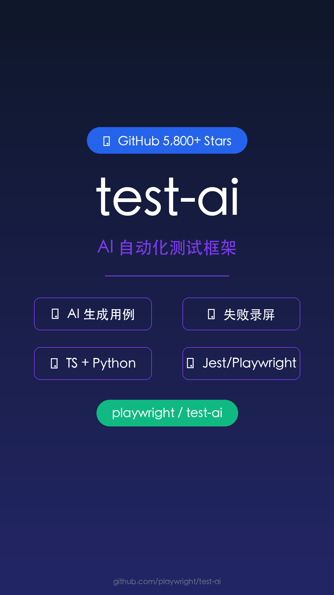

# 视频标题：test-ai - 自动化测试框架，让 QA 效率提升 10 倍

## 元数据
- **平台**: 微信视频号 / 小红书 / 抖音
- **时长**: 50-60秒
- **主题**: 科技现代风
- **帧率**: 60fps
- **分辨率**: 1080x1920 (9:16竖屏)

## 小红书版本
### 标题
测试用例自己写？这款 AI 工具让 QA 彻底躺平 🤖✨

### 正文
手动写测试用例太痛苦了？试试 test-ai！

它能 AI 自动生成测试用例，失败自动录屏，TypeScript + Python 双语言支持，还兼容 Jest 和 Playwright。

GitHub 5.8K Stars，全球 QA 团队都在用。

#自动化测试 #AI工具 #QA工程师 #测试开发 #程序员 #编程 #效率神器

### 标签
#自动化测试 #AI工具 #QA工程师 #测试开发 #程序员 #效率神器 #Playwright #Jest

## 视频号版本
### 标题
AI 自动生成测试用例，失败自动录屏！这款测试框架太牛了

### 描述
test-ai 是一款 AI 驱动的自动化测试框架，能自动生成测试用例，失败自动录屏。支持 TypeScript + Python，兼容 Jest 和 Playwright。GitHub 5.8K Stars，QA 团队必备！

### 话题
#自动化测试 #AI工具 #QA工程师 #程序员

## 封面图

## 视频脚本（配音词）

### 场景1: 封面 (0-3秒)
- **画面**: 科技感深色背景，项目名和核心功能大字居中
- **文字**: test-ai | AI 自动生成测试用例
- **动画**: 淡入 + 轻微缩放

### 场景2: 痛点引入 (3-8秒)
- **画面**: 展示手动写测试用例的繁琐场景
- **文字**: 手动写测试用例，耗时又费力？
- **配音**: "还在为手动编写测试用例而头疼？每次修改代码，测试用例也要跟着改，费时又容易出错。"

### 场景3: 核心功能介绍 (8-20秒)
- **画面**: 三个功能模块依次展示
- **文字**:
  - 🤖 AI 自动生成测试用例
  - 🎬 失败自动录屏
  - 🔧 TypeScript + Python 双语言
- **配音**: "test-ai 来帮你了。它有三大核心功能：第一，AI 自动分析代码并生成测试用例，你只需要确认即可。第二，测试失败时自动录屏，帮你快速定位问题。第三，支持 TypeScript 和 Python 双语言开发。"

### 场景4: 框架兼容 (20-28秒)
- **画面**: Jest 和 Playwright 的 logo 展示
- **文字**: 兼容 Jest | 兼容 Playwright
- **配音**: "它无缝集成 Jest 和 Playwright，无论你用哪个框架，都能轻松接入。"

### 场景5: 数据展示 (28-36秒)
- **画面**: GitHub Stars 数据大字展示
- **文字**: GitHub 5,800 Stars
- **配音**: "这个项目在 GitHub 上已经收获了 5800 颗星，深受全球开发者喜爱。"

### 场景6: 适用人群 (36-44秒)
- **画面**: QA 团队工作场景
- **文字**: 适用人群：QA 团队 | 测试开发工程师
- **配音**: "非常适合 QA 团队和测试开发工程师，让你们从繁琐的手动测试中解放出来。"

### 场景7: 行动号召 (44-50秒)
- **画面**: 项目地址和 Star 按钮
- **文字**: github.com/playwright/test-ai
- **配音**: "想提升测试效率？赶紧去 GitHub 看看，搜索 playwright test-ai，一键 Star，开始你的 AI 测试之旅！"

## 内容插图说明
- 封面图: 科技感深色背景，项目名居中，功能标签展示
- 场景图: 每个功能点配一个简洁的视觉图标
- 数据图: GitHub Stars 数字展示，配渐变背景
