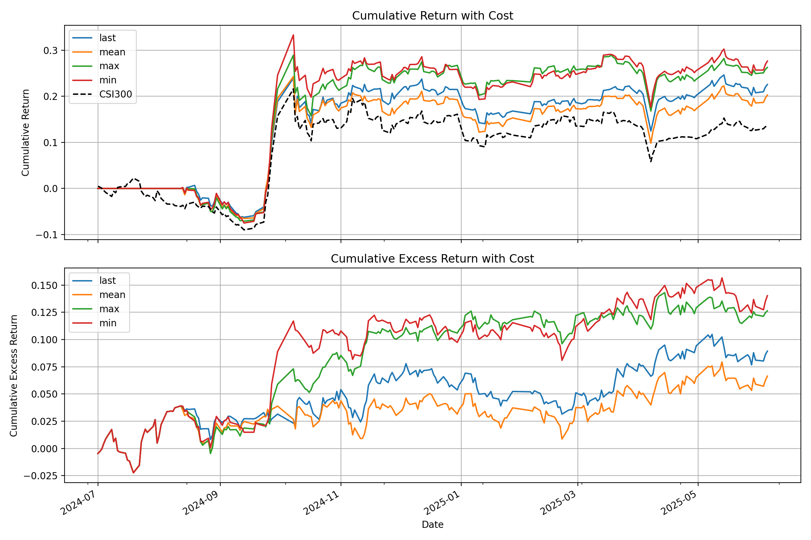

# GitHub - shiyu-coder/Kronos: Kronos: A Foundation Model for the Language of Financial Markets · GitHub

## Kronos: A Foundation Model for the Language of Financial Markets

 [](https://huggingface.co/NeoQuasar)[ ](https://shiyu-coder.github.io/Kronos-demo/)[ ](https://github.com/shiyu-coder/Kronos/graphs/commit-activity)[ ](https://github.com/shiyu-coder/Kronos/stargazers)[ ](https://github.com/shiyu-coder/Kronos/network/members)[](https://github.com/shiyu-coder/Kronos/blob/master/LICENSE)

[Deutsch](https://zdoc.app/de/shiyu-coder/Kronos) | [Español](https://zdoc.app/es/shiyu-coder/Kronos) | [Français](https://zdoc.app/fr/shiyu-coder/Kronos) | [日本語](https://zdoc.app/ja/shiyu-coder/Kronos) | [한국어](https://zdoc.app/ko/shiyu-coder/Kronos) | [Português](https://zdoc.app/pt/shiyu-coder/Kronos) | [Русский](https://zdoc.app/ru/shiyu-coder/Kronos) | [中文](https://zdoc.app/zh/shiyu-coder/Kronos)

[](https://github.com/shiyu-coder/Kronos/blob/master/figures/logo.png)

> Kronos is the **first open-source foundation model** for financial candlesticks (K-lines), trained on data from over **45 global exchanges**.

## 📰 News

- 🚩 **\[2025.11.10\]** Kronos has been accpeted by AAAI 2026.
- 🚩 **\[2025.08.17\]** We have released the scripts for fine-tuning! Check them out to adapt Kronos to your own tasks.
- 🚩 **\[2025.08.02\]** Our paper is now available on [arXiv](https://arxiv.org/abs/2508.02739)!

## 📜 Introduction

**Kronos** is a family of decoder-only foundation models, pre-trained specifically for the "language" of financial markets—K-line sequences. Unlike general-purpose TSFMs, Kronos is designed to handle the unique, high-noise characteristics of financial data. It leverages a novel two-stage framework:

1. A specialized tokenizer first quantizes continuous, multi-dimensional K-line data (OHLCV) into **hierarchical discrete tokens**.
2. A large, autoregressive Transformer is then pre-trained on these tokens, enabling it to serve as a unified model for diverse quantitative tasks.

[](assets/imgs/imgs/img-005-overview.png)

## ✨ Live Demo

We have set up a live demo to visualize Kronos's forecasting results. The webpage showcases a forecast for the **BTC/USDT** trading pair over the next 24 hours.

**👉 [Access the Live Demo Here](https://shiyu-coder.github.io/Kronos-demo/)**

## 📦 Model Zoo

We release a family of pre-trained models with varying capacities to suit different computational and application needs. All models are readily accessible from the Hugging Face Hub.

| Model | Tokenizer | Context length | Params | Open-source |
| --- | --- | --- | --- | --- |
| Kronos-mini | [Kronos-Tokenizer-2k](https://huggingface.co/NeoQuasar/Kronos-Tokenizer-2k) | 2048 | 4.1M | ✅ [NeoQuasar/Kronos-mini](https://huggingface.co/NeoQuasar/Kronos-mini) |
| Kronos-small | [Kronos-Tokenizer-base](https://huggingface.co/NeoQuasar/Kronos-Tokenizer-base) | 512 | 24.7M | ✅ [NeoQuasar/Kronos-small](https://huggingface.co/NeoQuasar/Kronos-small) |
| Kronos-base | [Kronos-Tokenizer-base](https://huggingface.co/NeoQuasar/Kronos-Tokenizer-base) | 512 | 102.3M | ✅ [NeoQuasar/Kronos-base](https://huggingface.co/NeoQuasar/Kronos-base) |
| Kronos-large | [Kronos-Tokenizer-base](https://huggingface.co/NeoQuasar/Kronos-Tokenizer-base) | 512 | 499.2M | ❌ |

## 🚀 Getting Started

### Installation

1. Install Python 3.10+, and then install the dependencies:
```
pip install -r requirements.txt
```

### 📈 Making Forecasts

Forecasting with Kronos is straightforward using the `KronosPredictor` class. It handles data preprocessing, normalization, prediction, and inverse normalization, allowing you to get from raw data to forecasts in just a few lines of code.

**Important Note**: The `max_context` for `Kronos-small` and `Kronos-base` is **512**. This is the maximum sequence length the model can process. For optimal performance, it is recommended that your input data length (i.e., `lookback`) does not exceed this limit. The `KronosPredictor` will automatically handle truncation for longer contexts.

Here is a step-by-step guide to making your first forecast.

#### 1\. Load the Tokenizer and Model

First, load a pre-trained Kronos model and its corresponding tokenizer from the Hugging Face Hub.

```
from model import Kronos, KronosTokenizer, KronosPredictor

# Load from Hugging Face Hub
tokenizer = KronosTokenizer.from_pretrained("NeoQuasar/Kronos-Tokenizer-base")
model = Kronos.from_pretrained("NeoQuasar/Kronos-small")
```

#### 2\. Instantiate the Predictor

Create an instance of `KronosPredictor`, passing the model, tokenizer, and desired device.

```
# Initialize the predictor
predictor = KronosPredictor(model, tokenizer, max_context=512)
```

#### 3\. Prepare Input Data

The `predict` method requires three main inputs:

- `df`: A pandas DataFrame containing the historical K-line data. It must include columns `['open', 'high', 'low', 'close']`. `volume` and `amount` are optional.
- `x_timestamp`: A pandas Series of timestamps corresponding to the historical data in `df`.
- `y_timestamp`: A pandas Series of timestamps for the future periods you want to predict.
```
import pandas as pd

# Load your data
df = pd.read_csv("./data/XSHG_5min_600977.csv")
df['timestamps'] = pd.to_datetime(df['timestamps'])

# Define context window and prediction length
lookback = 400
pred_len = 120

# Prepare inputs for the predictor
x_df = df.loc[:lookback-1, ['open', 'high', 'low', 'close', 'volume', 'amount']]
x_timestamp = df.loc[:lookback-1, 'timestamps']
y_timestamp = df.loc[lookback:lookback+pred_len-1, 'timestamps']
```

#### 4\. Generate Forecasts

Call the `predict` method to generate forecasts. You can control the sampling process with parameters like `T`, `top_p`, and `sample_count` for probabilistic forecasting.

```
# Generate predictions
pred_df = predictor.predict(
    df=x_df,
    x_timestamp=x_timestamp,
    y_timestamp=y_timestamp,
    pred_len=pred_len,
    T=1.0,          # Temperature for sampling
    top_p=0.9,      # Nucleus sampling probability
    sample_count=1  # Number of forecast paths to generate and average
)

print("Forecasted Data Head:")
print(pred_df.head())
```

The `predict` method returns a pandas DataFrame containing the forecasted values for `open`, `high`, `low`, `close`, `volume`, and `amount`, indexed by the `y_timestamp` you provided.

For efficient processing of multiple time series, Kronos provides a `predict_batch` method that enables parallel prediction on multiple datasets simultaneously. This is particularly useful when you need to forecast multiple assets or time periods at once.

```
# Prepare multiple datasets for batch prediction
df_list = [df1, df2, df3]  # List of DataFrames
x_timestamp_list = [x_ts1, x_ts2, x_ts3]  # List of historical timestamps
y_timestamp_list = [y_ts1, y_ts2, y_ts3]  # List of future timestamps

# Generate batch predictions
pred_df_list = predictor.predict_batch(
    df_list=df_list,
    x_timestamp_list=x_timestamp_list,
    y_timestamp_list=y_timestamp_list,
    pred_len=pred_len,
    T=1.0,
    top_p=0.9,
    sample_count=1,
    verbose=True
)

# pred_df_list contains prediction results in the same order as input
for i, pred_df in enumerate(pred_df_list):
    print(f"Predictions for series {i}:")
    print(pred_df.head())
```

**Important Requirements for Batch Prediction:**

- All series must have the same historical length (lookback window)
- All series must have the same prediction length (`pred_len`)
- Each DataFrame must contain the required columns: `['open', 'high', 'low', 'close']`
- `volume` and `amount` columns are optional and will be filled with zeros if missing

The `predict_batch` method leverages GPU parallelism for efficient processing and automatically handles normalization and denormalization for each series independently.

#### 5\. Example and Visualization

For a complete, runnable script that includes data loading, prediction, and plotting, please see [`examples/prediction_example.py`](https://github.com/shiyu-coder/Kronos/blob/master/examples/prediction_example.py).

Running this script will generate a plot comparing the ground truth data against the model's forecast, similar to the one shown below:

[](assets/imgs/imgs/img-006-prediction_example.png)

Additionally, we provide a script that makes predictions without Volume and Amount data, which can be found in [`examples/prediction_wo_vol_example.py`](https://github.com/shiyu-coder/Kronos/blob/master/examples/prediction_wo_vol_example.py).

We provide a complete pipeline for finetuning Kronos on your own datasets. As an example, we demonstrate how to use [Qlib](https://github.com/microsoft/qlib) to prepare data from the Chinese A-share market and conduct a simple backtest.

> **Disclaimer:** This pipeline is intended as a demonstration to illustrate the finetuning process. It is a simplified example and not a production-ready quantitative trading system. A robust quantitative strategy requires more sophisticated techniques, such as portfolio optimization and risk factor neutralization, to achieve stable alpha.

The finetuning process is divided into four main steps:

1. **Configuration**: Set up paths and hyperparameters.
2. **Data Preparation**: Process and split your data using Qlib.
3. **Model Finetuning**: Finetune the Tokenizer and the Predictor models.
4. **Backtesting**: Evaluate the finetuned model's performance.

### Prerequisites

1. First, ensure you have all dependencies from `requirements.txt` installed.
2. This pipeline relies on `qlib`. Please install it:
	```
	pip install pyqlib
	```
3. You will need to prepare your Qlib data. Follow the [official Qlib guide](https://github.com/microsoft/qlib) to download and set up your data locally. The example scripts assume you are using daily frequency data.

### Step 1: Configure Your Experiment

All settings for data, training, and model paths are centralized in `finetune/config.py`. Before running any scripts, please **modify the following paths** according to your environment:

- `qlib_data_path`: Path to your local Qlib data directory.
- `dataset_path`: Directory where the processed train/validation/test pickle files will be saved.
- `save_path`: Base directory for saving model checkpoints.
- `backtest_result_path`: Directory for saving backtesting results.
- `pretrained_tokenizer_path` and `pretrained_predictor_path`: Paths to the pre-trained models you want to start from (can be local paths or Hugging Face model names).

You can also adjust other parameters like `instrument`, `train_time_range`, `epochs`, and `batch_size` to fit your specific task. If you don't use [Comet.ml](https://www.comet.com/), set `use_comet = False`.

### Step 2: Prepare the Dataset

Run the data preprocessing script. This script will load raw market data from your Qlib directory, process it, split it into training, validation, and test sets, and save them as pickle files.

```
python finetune/qlib_data_preprocess.py
```

After running, you will find `train_data.pkl`, `val_data.pkl`, and `test_data.pkl` in the directory specified by `dataset_path` in your config.

### Step 3: Run the Finetuning

The finetuning process consists of two stages: finetuning the tokenizer and then the predictor. Both training scripts are designed for multi-GPU training using `torchrun`.

#### 3.1 Finetune the Tokenizer

This step adjusts the tokenizer to the data distribution of your specific domain.

```
# Replace NUM_GPUS with the number of GPUs you want to use (e.g., 2)
torchrun --standalone --nproc_per_node=NUM_GPUS finetune/train_tokenizer.py
```

The best tokenizer checkpoint will be saved to the path configured in `config.py` (derived from `save_path` and `tokenizer_save_folder_name`).

#### 3.2 Finetune the Predictor

This step finetunes the main Kronos model for the forecasting task.

```
# Replace NUM_GPUS with the number of GPUs you want to use (e.g., 2)
torchrun --standalone --nproc_per_node=NUM_GPUS finetune/train_predictor.py
```

The best predictor checkpoint will be saved to the path configured in `config.py`.

### Step 4: Evaluate with Backtesting

Finally, run the backtesting script to evaluate your finetuned model. This script loads the models, performs inference on the test set, generates prediction signals (e.g., forecasted price change), and runs a simple top-K strategy backtest.

```
# Specify the GPU for inference
python finetune/qlib_test.py --device cuda:0
```

The script will output a detailed performance analysis in your console and generate a plot showing the cumulative return curves of your strategy against the benchmark, similar to the one below:

[](assets/imgs/imgs/img-007-backtest_result_example.png)

### 💡 From Demo to Production: Important Considerations

- **Raw Signals vs. Pure Alpha**: The signals generated by the model in this demo are raw predictions. In a real-world quantitative workflow, these signals would typically be fed into a portfolio optimization model. This model would apply constraints to neutralize exposure to common risk factors (e.g., market beta, style factors like size and value), thereby isolating the **"pure alpha"** and improving the strategy's robustness.
- **Data Handling**: The provided `QlibDataset` is an example. For different data sources or formats, you will need to adapt the data loading and preprocessing logic.
- **Strategy and Backtesting Complexity**: The simple top-K strategy used here is a basic starting point. Production-level strategies often incorporate more complex logic for portfolio construction, dynamic position sizing, and risk management (e.g., stop-loss/take-profit rules). Furthermore, a high-fidelity backtest should meticulously model transaction costs, slippage, and market impact to provide a more accurate estimate of real-world performance.

> **📝 AI-Generated Comments**: Please note that many of the code comments within the `finetune/` directory were generated by an AI assistant (Gemini 2.5 Pro) for explanatory purposes. While they aim to be helpful, they may contain inaccuracies. We recommend treating the code itself as the definitive source of logic.

## 📖 Citation

If you use Kronos in your research, we would appreciate a citation to our [paper](https://arxiv.org/abs/2508.02739):

```
@misc{shi2025kronos,
      title={Kronos: A Foundation Model for the Language of Financial Markets},
      author={Yu Shi and Zongliang Fu and Shuo Chen and Bohan Zhao and Wei Xu and Changshui Zhang and Jian Li},
      year={2025},
      eprint={2508.02739},
      archivePrefix={arXiv},
      primaryClass={q-fin.ST},
      url={https://arxiv.org/abs/2508.02739%7D,
}
```