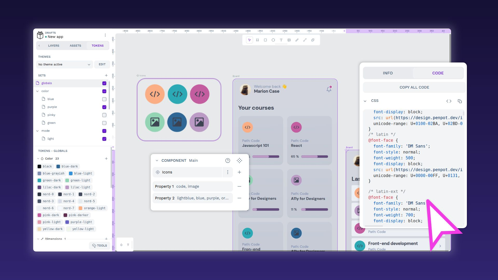
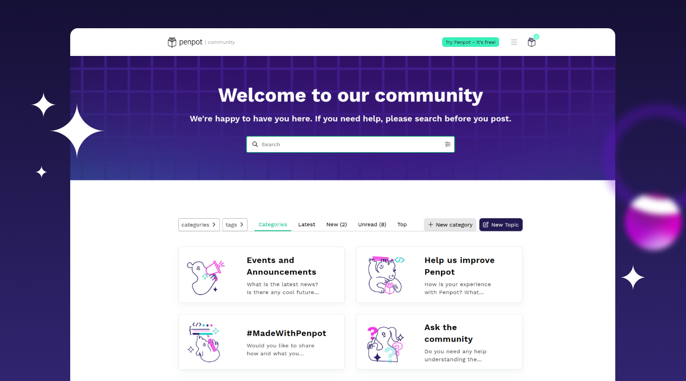
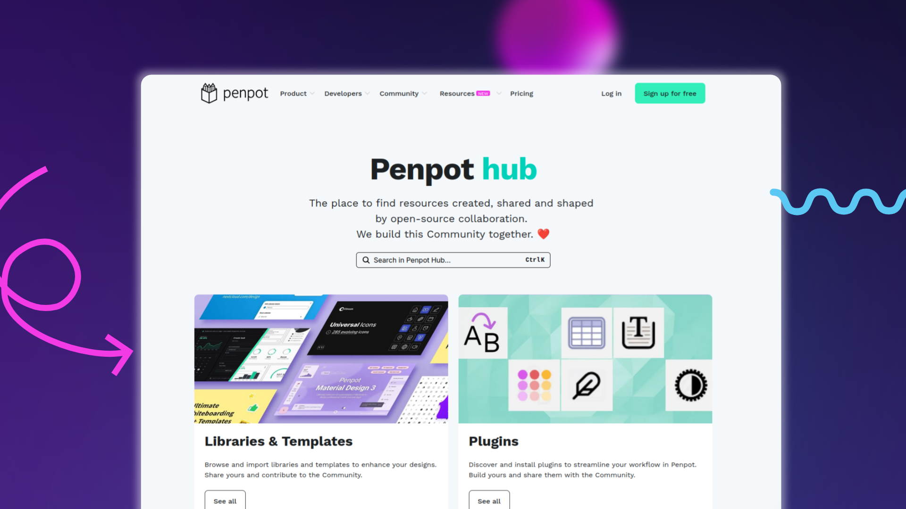

# GitHub - penpot/penpot: Penpot: The open-source design tool for design and code collaboration · GitHub


 [](https://www.digitalpublicgoods.net/r/penpot)[ ](https://community.penpot.app/)[ ](https://tree.taiga.io/project/penpot/)[](https://gitpod.io/#https://github.com/penpot/penpot)

[**Website**](https://penpot.app/) • [**User Guide**](https://help.penpot.app/user-guide/) • [**Learning Center**](https://penpot.app/learning-center) • [**Community**](https://community.penpot.app/)

[**Youtube**](https://www.youtube.com/@Penpot) • [**Peertube**](https://peertube.kaleidos.net/a/penpot_app/video-channels) • [**Linkedin**](https://www.linkedin.com/company/penpot/) • [**Instagram**](https://instagram.com/penpot.app) • [**Mastodon**](https://fosstodon.org/@penpot/) • [**Bluesky**](https://bsky.app/profile/penpot.app) • [**X**](https://twitter.com/penpotapp)

Penpot\_OpenYourEyes\_.mp4<video src="assets/imgs/videos/video-001-451453487-7c67fd7c-04d3-4c9b-88ec-b6f5e23f8332.mp4" controls="controls"></video>

Penpot is the open-source design platform for teams that build digital products at scale.

Penpot’s key strength lies in giving you **full ownership of your design infrastructure**. Built on open source and designed for [self-hosting](https://help.penpot.app/technical-guide/getting-started/), it puts teams in complete control of their design environment supporting strict compliance and governance requirements. Whether used in the **browser or deployed on your own servers**, Penpot **works with open standards** like SVG, CSS, HTML, and JSON.

Real-time collaboration strengthens this foundation, helping teams scale and bring design closer to the product through top-tier capabilities. Additionally, developers feel at home using Penpot, because design is expressed as code, enabling a direct translation and shipping products faster.

Best-in-class native [Design Tokens](https://penpot.dev/collaboration/design-tokens) provide a single source of truth between design and development. They ensure consistency, improve collaboration, and make it easier to manage complex design systems.

The [MCP server](https://penpot.app/penpot-mcp-server) takes it further by enabling multi-directional workflows between design and code. A [powerful open API](https://help.penpot.app/mcp/#quick-start) and plugin system makes the workspace programmable, enabling automation, AI-driven workflows, and integrations with the tools and systems you already use.

With [CSS Grid and Flex Layout](https://help.penpot.app/user-guide/designing/flexible-layouts/), teams can design responsive interfaces that behave like real code from the start.

Combined, these features turn Penpot into a **full-stack design platform** for building scalable design systems and fully integrated product development processes.

If your organization is scaling and needs extra support, we’re here to help. [Talk to us](https://penpot.app/talk-to-us)

## Table of contents

- [Why Penpot](https://github.com/penpot/penpot#why-penpot)
- [Getting Started](https://github.com/penpot/penpot#getting-started)
- [Community](https://github.com/penpot/penpot#community)
- [Contributing](https://github.com/penpot/penpot#contributing)
- [Resources](https://github.com/penpot/penpot#resources)
- [License](https://github.com/penpot/penpot#license)

## Why Penpot

Penpot connects design, code, and AI workflows through a code-based approach, making designs readable by developers and AI via the MCP server. This approach helps teams ship what’s actually designed and manage design systems at scale with powerful design tokens. As a self-hosted, open-source and real-time collaboration platform, Penpot offers full flexibility, security, and ownership without vendor lock-in. Learn more about [why Penpot](https://penpot.app/why-penpot) is the platform for your team.

### Plugin system

[Penpot plugins](https://penpot.app/penpothub/plugins) let you expand the platform's capabilities, give you the flexibility to integrate it with other apps, and design custom solutions.

### Designed for developers

Penpot was built to serve both designers and developers and create a fluid design-code process. You have the choice to enjoy real-time collaboration or play "solo".

### Inspect mode

Work with ready-to-use code and make your workflow easy and fast. The inspect tab gives instant access to SVG, CSS and HTML code.

### Integrations

Penpot offers [integration](https://penpot.app/integrations-api) into the development toolchain, thanks to its support for webhooks and an API accessible through access tokens.

### Building Design Systems: design tokens, components and variants

Penpot brings [design systems](https://penpot.app/design/design-systems) to code-minded teams: a single source of truth with native Design Tokens, Components, and Variants for scalable, reusable, and consistent UI across projects and platforms.



## Getting started

Penpot is the only design & prototype platform that is deployment agnostic. You can use it in our [SAAS](https://design.penpot.app/) or deploy it anywhere.

Learn how to install it with Docker, Kubernetes, Elestio or other options on [our website](https://penpot.app/self-host).

## Community

We love the Open Source software community. Contributing is our passion and if it’s yours too, participate and [improve](https://community.penpot.app/c/help-us-improve-penpot/7) Penpot. All your designs, code and ideas are welcome!

Want to go a step further? Become a [Penpot Ambassador](https://penpot.app/ambassador-program) and help grow the Penpot community in your region while contributing to a global, open design ecosystem.

If you need help or have any questions; if you’d like to share your experience using Penpot or get inspired; if you’d rather meet our community of developers and designers, [join our Community](https://community.penpot.app/)!

Categories include:

- [Ask the Community](https://community.penpot.app/c/ask-for-help-using-penpot/6)
- [Troubleshooting](https://community.penpot.app/c/technical/8)
- [Help us Improve Penpot](https://community.penpot.app/c/help-us-improve-penpot/7)
- [Events and Announcements](https://community.penpot.app/c/announcements/5)
- [Penpot in your language](https://community.penpot.app/c/penpot-in-your-language/12)
- [Education](https://community.penpot.app/c/education/28)


### Code of Conduct

Anyone who contributes to Penpot, whether through code, in the community, or at an event, must adhere to the [code of conduct](https://help.penpot.app/contributing-guide/coc/) and foster a positive and safe environment.

### Contributing

Any contribution will make a difference to improve Penpot. How can you get involved?

Choose your way:

- Create and [share Libraries & Templates](https://penpot.app/libraries-templates.html) that will be helpful for the community.
- Invite your [team to join](https://design.penpot.app/#/auth/register).
- Give this repo a star and follow us on Social Media: [Mastodon](https://fosstodon.org/@penpot/), [Youtube](https://www.youtube.com/c/Penpot), [Instagram](https://instagram.com/penpot.app), [Linkedin](https://www.linkedin.com/company/penpotdesign), [Peertube](https://peertube.kaleidos.net/a/penpot_app), [X](https://twitter.com/penpotapp) and [BlueSky](https://bsky.app/profile/penpot.app).
- Participate in the [Community](https://community.penpot.app/) space by asking and answering questions; reacting to others’ articles; opening your own conversations and following along on decisions affecting the project.
- Report bugs with our easy [guide for bugs hunting](https://help.penpot.app/contributing-guide/reporting-bugs/) or [GitHub issues](https://github.com/penpot/penpot/issues).
- Become a [translator](https://help.penpot.app/contributing-guide/translations).
- Give feedback: [Email us](mailto:support@penpot.app).
- **Contribute to Penpot's code:** [Watch this video](https://www.youtube.com/watch?v=TpN0osiY-8k) by Alejandro Alonso, CIO and developer at Penpot, where he gives us a hands-on demo of how to use Penpot’s repository and make changes in both front and back end.

To find (almost) everything you need to know on how to contribute to Penpot, refer to the [contributing guide](https://help.penpot.app/contributing-guide/).



## Resources

You can ask and answer questions, have open-ended conversations, and follow along on decisions affecting the project.

💾 [Documentation](https://help.penpot.app/technical-guide/)

🚀 [Getting Started](https://help.penpot.app/technical-guide/getting-started/)

✏️ [Tutorials](https://www.youtube.com/playlist?list=PLgcCPfOv5v54WpXhHmNO7T-YC7AE-SRsr)

🏘️ [Architecture](https://help.penpot.app/technical-guide/developer/architecture/)

📚 [Dev Diaries](https://penpot.app/dev-diaries.html)

🧑🏫 [UI Design Course](https://penpot.app/courses/)

## License

```
This Source Code Form is subject to the terms of the Mozilla Public
License, v. 2.0. If a copy of the MPL was not distributed with this
file, You can obtain one at http://mozilla.org/MPL/2.0/

Copyright (c) KALEIDOS INC
```

Penpot is a Kaleidos’ [open source project](https://kaleidos.net/)