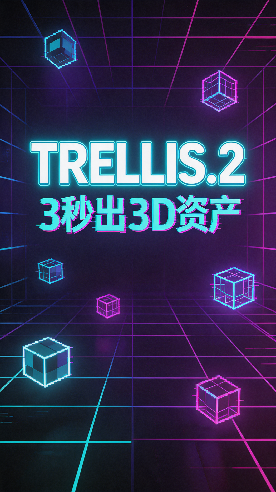

# TRELLIS.2 - 微软 3D 生成大模型

## 元数据
- **平台**: 微信视频号 / 小红书
- **时长**: 约50秒
- **主题**: tech-modern (科技现代风)

## 小红书版本

### 标题
⚡微软开源40亿参数3D生成模型！3秒生成一个3D资产

### 正文
微软TRELLIS.2来了！

40亿参数的大型3D生成模型，通过O-Voxel稀疏体素结构，实现高质量图像转3D。

核心能力：
✅ 512³分辨率仅需3秒
✅ 支持任意拓扑（服装、树叶、非流形几何）
✅ 完整PBR材质（颜色、粗糙度、金属度、透明度）
✅ 无需渲染优化，直接转换

GitHub: microsoft/TRELLIS.2
HuggingFace: microsoft/TRELLIS.2-4B

#AI #3D生成 #微软 #开源 #机器学习 #深度学习 #计算机图形学 #AIGC #HuggingFace

### 标签
#AI #3D生成 #微软 #开源 #机器学习 #深度学习 #计算机图形学 #AIGC #HuggingFace

## 视频号版本

### 标题
微软开源40亿参数3D生成模型！3秒出一个3D资产

### 描述
微软TRELLIS.2震撼发布！40亿参数大型3D生成模型，O-Voxel稀疏体素结构，512³分辨率仅需3秒，支持任意拓扑和完整PBR材质。

### 话题
#AI #3D生成 #微软 #开源 #科技

## 封面图

## 视频脚本

### 场景1: 封面 (0-3秒 | 帧0-180)
- **视觉**: 深色科技背景，中心居中布局，网格线背景
- **文字**: 
  - 主标题: "TRELLIS.2" (130px, 科技蓝 #2563EB)
  - 副标题: "微软40亿参数3D生成大模型" (36px, 白色)
- **动画**: scale 0.9→1 + opacity 0→1，20帧入场

### 场景2: 震撼数据 (3-12秒 | 帧180-720)
- **视觉**: 深色背景，数据卡片居中，数字突出显示
- **文字**:
  - 标题: "3秒" (140px, 科技蓝, 加粗)
  - 副标题: "生成512³分辨率3D资产" (32px, 白色)
  - 底部: "微软用 Vanilla DiT 重塑3D生成" (24px, 灰色)
- **动画**: 数字弹跳入场 (spring效果)

### 场景3: O-Voxel技术 (12-22秒 | 帧720-1320)
- **视觉**: 科技卡片布局，中心说明文字
- **文字**:
  - 标题: "O-Voxel技术" (100px, 科技蓝)
  - 要点1: "✅ 开放曲面（服装、树叶）" (32px)
  - 要点2: "✅ 非流形几何" (32px)
  - 要点3: "✅ 内部封闭结构" (32px)
- **动画**: 逐行滑入 (stagger 10帧)

### 场景4: PBR材质 (22-32秒 | 帧1320-1920)
- **视觉**: 四个材质球并列展示
- **文字**:
  - 标题: "完整PBR材质" (80px, 科技蓝)
  - 四个标签: "基础颜色" "粗糙度" "金属度" "透明度" (28px)
  - 底部: "支持逼真渲染和透明度" (24px, 灰色)
- **动画**: 卡片scale弹入

### 场景5: 性能对比 (32-42秒 | 帧1920-2520)
- **视觉**: 表格布局，三个分辨率对比
- **文字**:
  - 标题: "生成速度" (80px, 科技蓝)
  - 分辨率512³: "3秒" (120px, 绿色)
  - 分辨率1024³: "17秒" (120px, 黄色)
  - 分辨率1536³: "60秒" (120px, 橙色)
- **动画**: 数字依次出现

### 场景6: 开源地址 (42-50秒 | 帧2520-3000)
- **视觉**: 深色背景，居中卡片
- **文字**:
  - 标题: "立即体验" (80px, 科技蓝)
  - GitHub: "github.com/microsoft/TRELLIS.2" (36px, 白色)
  - HuggingFace: "huggingface.co/microsoft/TRELLIS.2-4B" (36px, 白色)
- **动画**: fadeIn 30帧

### 场景7: 结尾 (48-50秒 | 帧2880-3000)
- **视觉**: 居中Logo，渐变背景
- **文字**:
  - 主标题: "TRELLIS.2" (100px, 科技蓝)
  - 副标题: "微软 · 40亿参数 · 开源" (28px, 灰色)
- **动画**: 渐显 + 轻微scale
