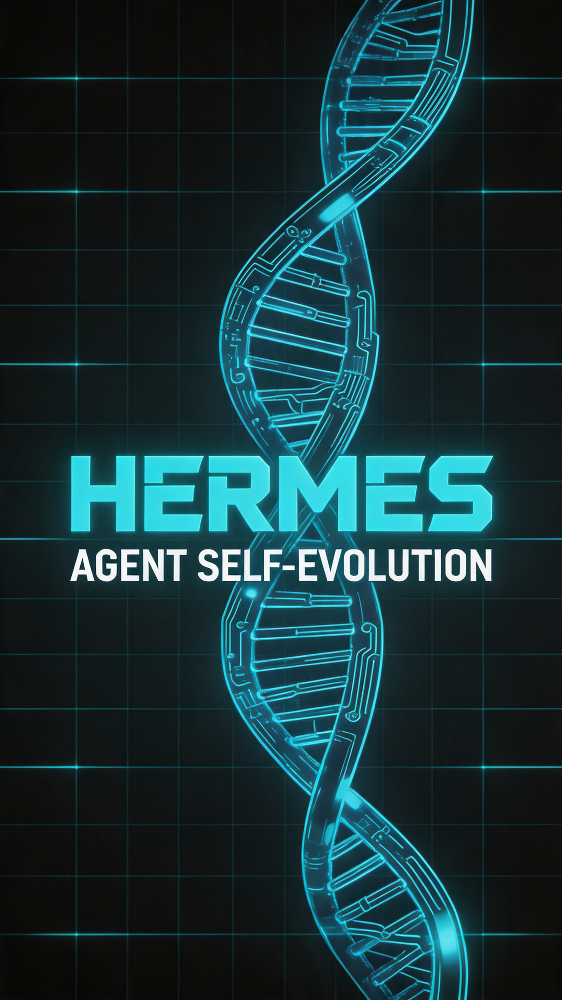

# Hermes Agent Self-Evolution 视频脚本

## 元数据
- **平台**: 微信视频号 / 小红书
- **时长**: 约50秒
- **主题**: tech-modern（科技现代风）
- **语速**: 1.2x

## 小红书版本

### 标题
⚡ AI Agent 自我进化！$2-10让AI自己优化自己

### 正文
AI Agent 能自己优化自己了。

这个开源项目，用 GEPA + DSPy 让 AI Agent 自动进化技能和提示词，不需要GPU，不需要训练，$2-10搞定一次优化。

核心卖点：
✅ 读懂"为什么失败" — 不只是知道失败
✅ 五阶段进化 — 技能→工具→提示词→代码
✅ Guardrails — 测试+大小+语义三重保障
✅ ICLR 2026 Oral — 学术认可

GitHub: NousResearch/hermes-agent-self-evolution

#AI #Agent #自我进化 #DSPy #开源 #LLM #ICLR

## 视频号版本

### 标题
AI Agent 能自己优化自己了！GEPA让AI自动进化

### 描述
用 GEPA + DSPy 让 AI Agent 自动进化技能和提示词，不需要GPU，不需要训练，每次优化运行约$2-10。

关键创新：GEPA 读懂"为什么"失败，然后针对性改进。

### 话题
#AI #Agent #开源 #科技

## 封面图

## 视频脚本

### 场景1: 封面 (0-3秒 | 帧0-180)
- **视觉**: 深色科技背景，中心居中布局，网格线背景
- **文字**:
  - 主标题: "Hermes" (120px, 科技蓝 #2563EB)
  - 副标题: "Agent 自我进化" (48px, 白色)
  - 底部: "GEPA + DSPy · $2-10/次" (28px, 青色)
- **动画**: scale 0.9→1 + opacity 0→1

### 场景2: 问题引出 (3-9秒 | 帧180-540)
- **视觉**: 深色背景，对比布局
- **文字**:
  - 标题: "传统 AI Agent 的瓶颈" (60px, 红色)
  - 要点: "人工调参，成本高，周期长" (36px)
  - 要点: "不知道"为什么"失败" (36px)
  - 要点: "每次都要从零优化" (36px)
- **动画**: 逐行滑入

### 场景3: 解决方案 (9-18秒 | 帧540-1080)
- **视觉**: 深色背景，流程图风格
- **文字**:
  - 标题: "GEPA 进化引擎" (80px, 科技蓝)
  - 核心: "读懂失败原因" (48px, 绿色)
  - 核心: "针对性突变" (48px, 绿色)
  - 说明: "No GPU · API Calls Only" (24px, 灰色)
  - 说明: "~$2-10 per run" (24px, 灰色)
- **动画**: fadeIn 30帧

### 场景4: 五阶段进化 (18-30秒 | 帧1080-1800)
- **视觉**: 深色背景，阶段卡片
- **文字**:
  - 标题: "五阶段进化" (80px, 科技蓝)
  - Phase1: "技能文件 SKILL.md ✅" (32px)
  - Phase2: "工具描述 🔲" (32px)
  - Phase3: "系统提示词 🔲" (32px)
  - Phase4: "工具实现代码 🔲" (32px)
  - Phase5: "持续改进循环 🔲" (32px)
- **动画**: 逐行滑入 (stagger 10帧)

### 场景5: Guardrails (30-38秒 | 帧1800-2280)
- **视觉**: 深色背景，盾牌/保障风格
- **文字**:
  - 标题: "Guardrails" (80px, 科技蓝)
  - 要点1: "100% 测试通过" (36px)
  - 要点2: "大小限制（技能≤15KB）" (36px)
  - 要点3: "语义保真" (36px)
  - 要点4: "人工PR审核" (36px)
- **动画**: scale弹入

### 场景6: 成果 (38-44秒 | 帧2280-2640)
- **视觉**: 深色背景，居中展示
- **文字**:
  - 标题: "ICLR 2026 Oral" (60px, 青色)
  - 副标题: "学术认可 · MIT许可" (32px, 灰色)
  - 说明: " NousResearch" (24px, 灰色)
- **动画**: fadeIn 30帧

### 场景7: CTA (44-50秒 | 帧2640-3000)
- **视觉**: 深色背景，居中卡片
- **文字**:
  - 标题: "立即体验" (80px, 科技蓝)
  - GitHub: "github.com/NousResearch/hermes-agent-self-evolution" (28px, 白色)
- **动画**: fadeIn + scale

## 配音脚本

AI Agent 能自己优化自己了。
传统优化的瓶颈：人工调参，成本高，周期长。
不知道"为什么"失败，只知道失败了。
每次都要从零开始。
Hermes Agent Self-Evolution，用 GEPA + DSPy 实现自动进化。
GEPA 读懂失败原因，不只是知道失败了。
针对性突变，而不是盲目随机。
No GPU，纯 API 调用。
$2-10 搞定一次优化。
五阶段进化：技能、工具、提示词、代码、持续循环。
Guardrails 保障：100%测试、大小限制，语义保真，人工审核。
ICLR 2026 Oral，学术认可，MIT许可。
github.com/NousResearch/hermes-agent-self-evolution
