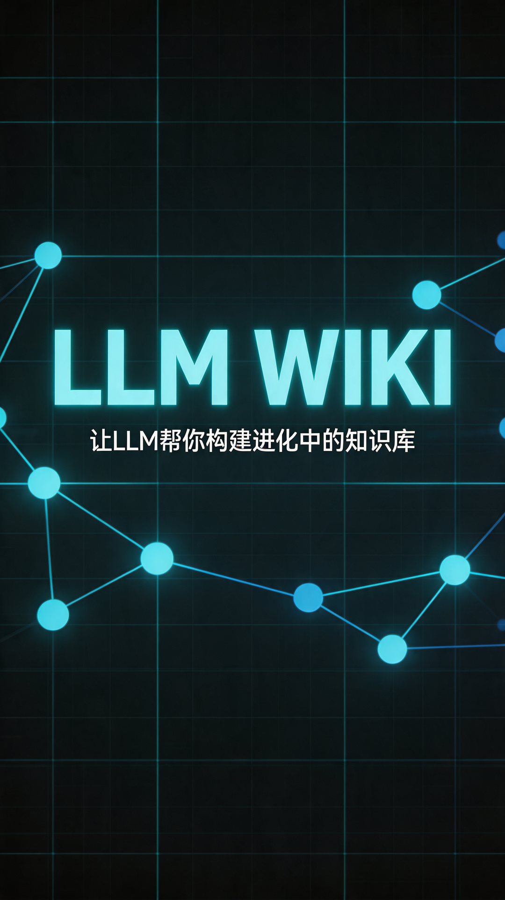

# LLM Wiki 视频脚本

## 元数据
- **平台**: 微信视频号 / 小红书
- **时长**: 约50秒
- **主题**: tech-modern（科技现代风）
- **语速**: 1.2x

## 小红书版本

### 标题
GitHub 2800+星！让LLM帮你增量构建一个进化中的Wiki

### 正文
不想每次问AI都重新检索一遍？

这个开源项目，让LLM增量构建一个结构化的Wiki，知识编译一次，持续进化。

核心功能：
✅ 四信号知识图谱 — 不是乱连，有算法的
✅ Louvain社区检测 — 自动发现你没意识到的知识盲区
✅ Chrome一键剪藏 — 网页直接纳入知识库
✅ Obsidian兼容 — 三栏布局，颜值在线

想做研究笔记、个人知识管理的，值得玩。

GitHub: nashsu/llm_wiki

#AI #知识管理 #RAG #GitHub #开源 #LLM #个人知识库 #Obsidian

### 标签
#AI #知识管理 #RAG #GitHub #开源 #LLM #个人知识库 #Obsidian #深度学习 #计算机

## 视频号版本

### 标题
GitHub爆火的开源知识库！让LLM帮你增量构建Wiki

### 描述
2800+星！不是传统RAG那种"每次都重新检索"的废物模式——LLM Wiki让AI直接帮你增量构建一个结构化Wiki，知识编译一次，持续进化。

四信号知识图谱、Louvain社区检测、Chrome网页剪藏、Obsidian兼容。

### 话题
#AI #知识管理 #GitHub #开源 #科技

## 封面图

## 视频脚本

### 场景1: 封面 (0-3秒 | 帧0-180)
- **视觉**: 深色科技背景，中心居中布局，网格线背景
- **文字**:
  - 主标题: "LLM Wiki" (120px, 科技蓝 #2563EB)
  - 副标题: "让LLM帮你构建进化中的知识库" (36px, 白色)
- **动画**: scale 0.9→1 + opacity 0→1，20帧入场

### 场景2: 问题引出 (3-8秒 | 帧180-480)
- **视觉**: 深色背景，对比布局
- **文字**:
  - 标题: "传统RAG的痛点" (80px, 科技蓝)
  - 要点: "每次查询都从零检索" (36px, 红色)
  - 要点: "没有结构化知识积累" (36px, 橙色)
  - 要点: "无法发现知识盲区" (36px, 黄色)
- **动画**: 逐行滑入 (stagger 10帧)

### 场景3: 核心概念 (8-18秒 | 帧480-1080)
- **视觉**: 深色背景，中心卡片
- **文字**:
  - 标题: "LLM Wiki 的思路" (80px, 科技蓝)
  - 核心: "知识编译一次" (48px, 绿色)
  - 核心: "持续进化" (48px, 绿色)
  - 说明: "基于 Karpathy 的 LLM Wiki 方法论" (24px, 灰色)
  - 说明: "GitHub 2800+ Stars" (24px, 灰色)
- **动画**: fadeIn 30帧

### 场景4: 四信号知识图谱 (18-28秒 | 帧1080-1680)
- **视觉**: 知识图谱可视化示意图
- **文字**:
  - 标题: "四信号知识图谱" (80px, 科技蓝)
  - 信号1: "直接链接 ×3.0" (32px)
  - 信号2: "来源重叠 ×4.0" (32px)
  - 信号3: "Adamic-Adar ×1.5" (32px)
  - 信号4: "类型亲和 ×1.0" (32px)
  - 说明: "sigma.js + graphology 可视化" (24px, 灰色)
- **动画**: 逐行滑入 (stagger 15帧)

### 场景5: Louvain社区检测 (28-36秒 | 帧1680-2160)
- **视觉**: 社区聚类示意图
- **文字**:
  - 标题: "Louvain 社区检测" (80px, 科技蓝)
  - 要点: "自动发现知识簇" (36px)
  - 要点: "内聚度评分" (36px)
  - 要点: "找到你没意识到的知识盲区" (36px, 橙色高亮)
- **动画**: scale弹入

### 场景6: 实用功能 (36-44秒 | 帧2160-2640)
- **视觉**: 三栏布局展示
- **文字**:
  - 标题: "Obsidian 兼容" (60px, 科技蓝)
  - 副标题: "三栏布局 · [[wikilink]] 语法" (28px, 白色)
  - 标题: "Chrome 网页剪藏" (60px, 科技蓝)
  - 副标题: "一键捕获，自动纳入知识库" (28px, 白色)
  - 标题: "两步思维链摄入" (60px, 科技蓝)
  - 副标题: "先分析 · 再生成 · 质量更高" (28px, 白色)
- **动画**: 逐行滑入 (stagger 10帧)

### 场景7: CTA (44-50秒 | 帧2640-3000)
- **视觉**: 深色背景，居中卡片
- **文字**:
  - 标题: "立即体验" (80px, 科技蓝)
  - GitHub: "github.com/nashsu/llm_wiki" (36px, 白色)
  - 说明: "GitHub 2800+ Stars" (28px, 灰色)
  - 说明: "跨平台桌面应用" (28px, 灰色)
- **动画**: fadeIn 30帧
