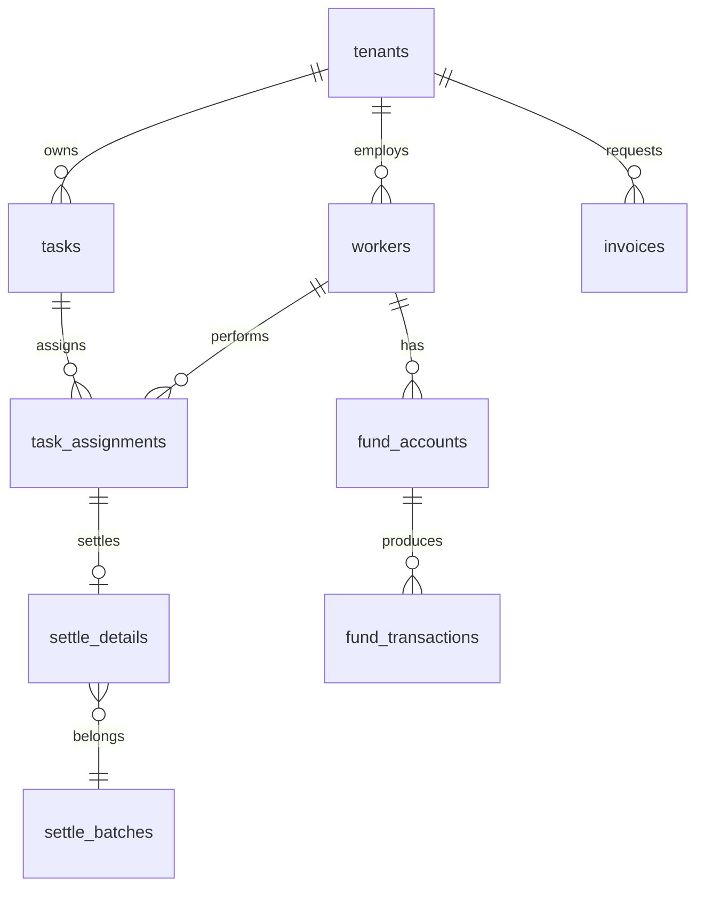
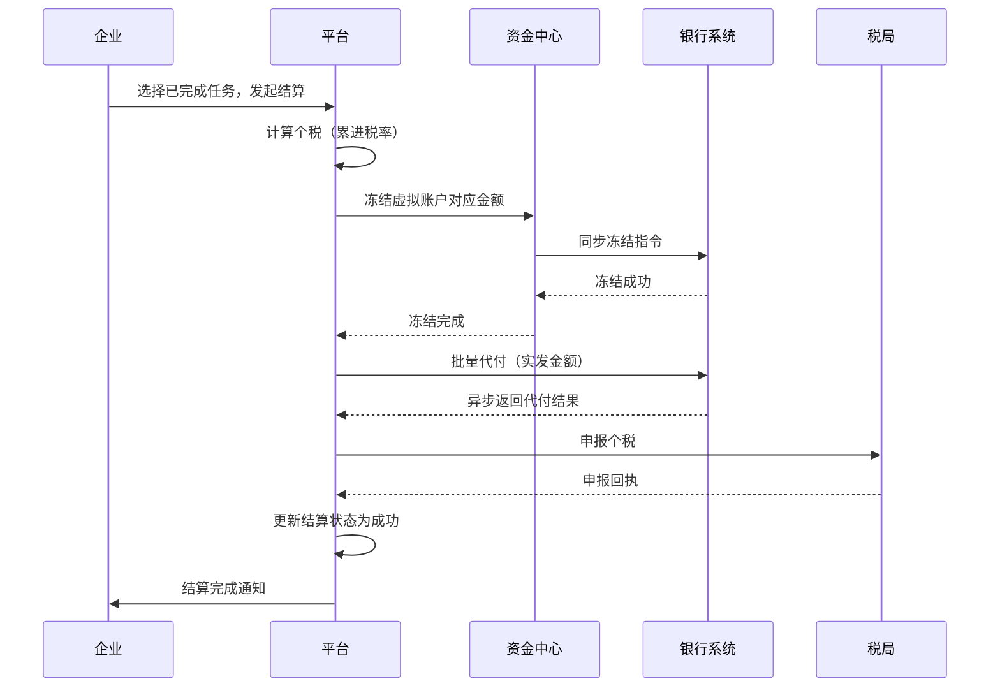

# 灵活用工结算平台完整研发方案

**文档版本**：V4.0  
**编制日期**：2026年05月15日  
**项目代号**：FLEX‑SETTLE  
**密级**：客户对外


## 目录

1. [项目概述](#1-项目概述)
2. [业务需求与功能范围](#2-业务需求与功能范围)
3. [技术架构设计](#3-技术架构设计)
4. [数据库设计](#4-数据库设计)
5. [核心业务流程](#5-核心业务流程)
6. [开发计划与里程碑](#6-开发计划与里程碑)
7. **报价与付款方案（首期40%）**
8. [部署与运维方案（Docker）](#8-部署与运维方案docker)
9. [质量保证与风险应对](#9-质量保证与风险应对)
10. [交付物清单](#10-交付物清单)


## 1. 项目概述

### 1.1 建设目标

建设一套面向灵活用工场景的**结算管理平台**，帮助企业完成对自由职业者（骑手、兼职等）的任务发布、接单执行、佣金结算、个税代扣、发票获取、资金对账等全流程线上化管理。平台采用多租户架构，支持多家企业独立入驻、数据物理隔离。

### 1.2 核心价值

- **合规高效**：自动完成个税计算与申报，打通银行虚拟账户实现秒级代付，形成“业务+资金+发票”三流合一。
- **成本可控**：通过标准化 SaaS 模式降低企业自建成本，30 万元内完成 4 个月定制开发。
- **易于部署**：采用 Docker 容器化，单机即可运行，无需 Kubernetes 复杂运维。

### 1.3 非功能性目标

| 指标             | 目标值                   |
| ---------------- | ------------------------ |
| 核心接口响应时间 | P95 ≤ 200ms              |
| 结算并发能力     | ≥ 100 TPS（批量代付）    |
| 可用性           | 99.9%（单机）            |
| 数据隔离         | Schema 级物理隔离        |
| 安全             | 敏感字段加密，HTTPS 传输 |


## 2. 业务需求与功能范围

### 2.1 角色与用例

| 角色           | 主要用例                                                   |
| -------------- | ---------------------------------------------------------- |
| **企业管理员** | 入驻审核、发布任务、验收任务、发起结算、申请发票、查看报表 |
| **自由职业者** | 实名认证、接单、执行任务、查看收入、绑定银行卡             |
| **平台运营**   | 租户管理、系统配置、异常订单处理、对账监控                 |

### 2.2 功能模块清单（不含电子签名）

| 模块         | 功能点                                                                           |
| ------------ | -------------------------------------------------------------------------------- |
| **用户中心** | 企业注册/登录/审核、个人实名认证（身份证+人脸）、角色权限（RBAC）                |
| **任务中心** | 任务发布（固定/计件/计时）、任务接单、任务执行（上传凭证）、任务验收             |
| **结算中心** | 批量结算申请、个税自动计算（累计预扣）、结算单生成、结算审核、银行代付、结果回调 |
| **资金中心** | 虚拟子账户管理（银行存管）、充值/冻结/解冻、资金流水查询、日终对账               |
| **发票中心** | 发票申请（专票/普票）、对接电子发票平台、发票下载、红冲申请                      |
| **税务中心** | 人员信息报送、个税申报（税局API）、完税凭证下载、申报记录查询                    |
| **报表中心** | 结算明细报表、服务费账单、发票统计、资金日报（Excel 导出）                       |
| **消息通知** | 短信/邮件/站内信（结算成功、发票开具等）                                         |
| **系统管理** | 租户隔离配置、字典维护、操作日志审计                                             |


## 3. 技术架构设计

### 3.1 技术栈总览

| 分层     | 技术                      | 版本/说明                |
| -------- | ------------------------- | ------------------------ |
| 前端     | Vue 3 + Vite + TypeScript | Composition API          |
| UI库     | Element Plus              | 桌面端组件               |
| 状态管理 | Pinia                     | 持久化 + 模块化          |
| 后端框架 | Hertz (Go)                | 字节开源高性能 HTTP 框架 |
| ORM      | GORM                      | 支持多租户 Schema 切换   |
| 数据库   | PostgreSQL 15+            | 核心数据存储             |
| 缓存     | Redis 7                   | 会话、分布式锁、热数据   |
| 消息队列 | RabbitMQ                  | 异步任务（结算、通知）   |
| 容器化   | Docker + Docker Compose   | 单机编排                 |
| 对象存储 | MinIO / 阿里云 OSS        | 发票文件、任务附件       |

### 3.2 多租户设计

- **隔离策略**：Schema‑per‑tenant。每个租户独立 Schema `tenant_{code}`，公共表在 `public` Schema。
- **租户识别**：前端请求头 `X-Tenant-ID` → 后端中间件校验 → 存入 `context` → GORM 回调动态设置 `search_path`。
- **连接池**：每个租户使用独立连接池（`gorm-multitenancy` 管理）。

### 3.3 后端模块结构（单体+内部模块化）

```
backend/
├── cmd/server/main.go          # 入口（同时启动 API 与 Worker）
├── internal/
│   ├── handler/                # HTTP 控制器
│   ├── service/                # 业务逻辑
│   ├── repository/             # 数据访问
│   ├── model/                  # GORM 模型
│   ├── middleware/             # 租户/认证/日志/限流
│   ├── worker/                 # 后台任务（消费 RabbitMQ）
│   └── scheduler/              # 定时任务（如每日对账）
├── pkg/                        # 公共库（errno, utils）
├── migrations/                 # 迁移脚本（public + tenant 模板）
└── configs/config.yaml
```

### 3.4 前端结构（Feature‑Sliced）

```
frontend/
├── src/
│   ├── app/                    # 路由、全局 store、入口
│   ├── pages/                  # 页面组件（按模块）
│   ├── features/               # 独立功能（上传、搜索）
│   ├── entities/               # 实体类型定义
│   └── shared/                 # UI 组件、API 客户端、工具
├── Dockerfile
└── nginx.conf
```

### 3.5 API 设计规范

- RESTful 风格，统一响应格式：
```json
{
  "code": 0,
  "message": "success",
  "data": {},
  "trace_id": "xxx"
}
```
- 错误码：`1xxx` 参数错误，`2xxx` 认证/权限，`3xxx` 业务异常，`5xxx` 系统错误。
- 认证：JWT（Access Token 2h，Refresh Token 7d），登录后返回。


## 4. 数据库设计

### 4.1 ERD 核心表（租户 Schema）



### 4.2 关键表结构（简化）

| 表名                | 主要字段                                                  | 说明         |
| ------------------- | --------------------------------------------------------- | ------------ |
| `workers`           | id, name, id_card(加密), phone(加密), bank_card_no        | 灵活就业人员 |
| `tasks`             | id, task_no, reward_amount, status, deadline              | 任务         |
| `task_assignments`  | id, task_id, worker_id, status                            | 接单记录     |
| `settle_batches`    | id, batch_no, total_amount, status                        | 结算批次     |
| `settle_details`    | id, settle_no, worker_id, amount, tax, actual, status     | 结算明细     |
| `fund_accounts`     | id, account_no, balance, frozen_balance                   | 虚拟账户     |
| `fund_transactions` | id, transaction_no, amount, balance_before, balance_after | 流水         |
| `invoices`          | id, invoice_no, amount, status, file_url                  | 发票申请     |

> 完整表结构及 SQL 脚本随交付物提供。

### 4.3 多租户迁移管理

- 使用 `golang-migrate` 管理 `public` 和租户模板。
- 新租户注册时自动执行：`CREATE SCHEMA tenant_xxx` → 运行模板迁移。


## 5. 核心业务流程

### 5.1 结算全流程



### 5.2 对账流程

- 每日凌晨 2:00 自动拉取银行对账单，与平台 `fund_transactions` 逐笔比对。
- 差异记录到 `reconciliation_diff` 表，并发送告警。


## 6. 开发计划与里程碑

总工期 **16 周**（4 个月），采用敏捷迭代。

### 6.1 阶段划分

| 阶段               | 周次    | 主要任务                                                                        | 里程碑产出                                      |
| ------------------ | ------- | ------------------------------------------------------------------------------- | ----------------------------------------------- |
| **一：基础框架**   | W1-W4   | 需求定稿、数据库设计、多租户骨架、认证中间件、Docker Compose 环境、前端工程搭建 | 可运行的空框架，支持租户切换，登录/租户管理可用 |
| **二：核心业务**   | W5-W8   | 用户中心、任务中心、结算引擎、资金中心（模拟银行接口）                          | 完整结算闭环可演示：发任务→接单→结算→代付回调   |
| **三：扩展功能**   | W9-W12  | 发票中心（对接电子票平台）、税务中心（税局申报）、报表中心、消息通知            | 全功能测试环境上线，内部测试通过                |
| **四：测试与交付** | W13-W16 | 集成测试、性能压测、文档编写、UAT、生产环境部署                                 | 正式交付验收，源代码+部署文档                   |

### 6.2 时间节点示例

| 里程碑                   | 计划日期   |
| ------------------------ | ---------- |
| 合同签订 & 首期付款      | 2026-05-18 |
| 基础框架完成             | 2026-06-14 |
| 核心结算跑通（二期验收） | 2026-07-12 |
| 全功能完成（三期验收）   | 2026-08-09 |
| 正式交付（四期验收）     | 2026-09-06 |


## 7. 报价与付款方案

### 7.1 总报价：30 万元（含税，包干价）

| 费用类别           | 金额（万元） | 说明                                                                |
| ------------------ | ------------ | ------------------------------------------------------------------- |
| 人力成本           | 21.6         | 项目经理(0.8×4) + 后端2人(1.0×4×2) + 前端2人(1.0×4×2) + 测试(0.8×3) |
| 外部服务（测试用） | 0.7          | 短信、OSS、发票平台测试账户                                         |
| 管理及风险         | 2.0          | 沟通、差旅、意外风险                                                |
| 税费及利润         | 5.7          | 约 19%                                                              |
| **合计**           | **30.0**     |                                                                     |

> 注：不含银行/税局等第三方接口的年度服务费，不含生产环境云资源费用。

### 7.2 付款计划（首期 40%）

| 期次 | 付款节点                           | 比例    | 金额（万元） | 交付物/验收标准                                |
| ---- | ---------------------------------- | ------- | ------------ | ---------------------------------------------- |
| 1    | 合同签订                           | **40%** | **12**       | 详细设计文档、开发计划、代码仓库初始化         |
| 2    | 阶段二里程碑完成（核心结算跑通）   | 30%     | 9            | 可演示的结算闭环，代码提交，里程碑评审通过     |
| 3    | 阶段三里程碑完成（全功能测试环境） | 20%     | 6            | 测试报告，用户验收环境就绪                     |
| 4    | 最终验收合格                       | 10%     | 3            | 源代码、部署文档、生产环境部署成功，签署验收单 |

### 7.3 包含与不包含

| 包含                                      | 不包含                                      |
| ----------------------------------------- | ------------------------------------------- |
| 全部源代码、Docker Compose 配置、迁移脚本 | 生产环境服务器、云资源（数据库、OSS等）费用 |
| API 文档、部署手册、运维手册              | 银行/税局/短信/发票第三方接口的商用授权费   |
| 1 个月免费远程缺陷修复                    | 驻场服务（如需，额外按人天计费）            |


## 8. 部署与运维方案（Docker）

### 8.1 硬件推荐配置

- **最小**：4核 CPU，8GB 内存，50GB SSD（适合日均单量 < 1000）
- **推荐**：8核 CPU，16GB 内存，100GB SSD（日均单量 5000+）

### 8.2 部署架构（单机 Docker Compose）

```yaml
# docker-compose.yml 核心服务
services:
  postgres:
    image: postgres:15
    environment:
      POSTGRES_DB: flex_settle
      POSTGRES_USER: flex
      POSTGRES_PASSWORD: ${DB_PASSWORD}
    volumes:
      - ./data/postgres:/var/lib/postgresql/data
  redis:
    image: redis:7-alpine
  rabbitmq:
    image: rabbitmq:3-management
  backend:
    build: ./backend
    depends_on: [postgres, redis, rabbitmq]
  worker:
    build: ./backend
    command: ["./worker"]
  frontend:
    build: ./frontend
  nginx:
    image: nginx:alpine
    ports:
      - "80:80"
      - "443:443"
```

### 8.3 数据备份策略

- PostgreSQL：每日凌晨 3:00 执行 `pg_dump` 并上传至 OSS，保留 30 天。
- Redis：开启 AOF + RDB。
- 容器日志：通过 `docker logs` 收集或映射到宿主机，使用 logrotate 轮转。

### 8.4 监控告警（轻量）

- 使用 `cAdvisor` + `Prometheus` + `Grafana` 可选（但不强制）。
- 必需的健康检查：每个容器提供 `/health` 端点，docker-compose 配置 `healthcheck`。


## 9. 质量保证与风险应对

### 9.1 测试策略

| 测试类型 | 工具             | 通过标准                          |
| -------- | ---------------- | --------------------------------- |
| 单元测试 | Go test / Vitest | 核心模块覆盖率 ≥ 70%              |
| 集成测试 | Postman + Newman | 所有 API 正常调用，多租户隔离验证 |
| 性能压测 | JMeter           | 结算接口 TPS ≥ 100，P95 < 500ms   |
| 安全测试 | 手工 + 工具      | 无 SQL 注入、XSS、越权漏洞        |

### 9.2 风险应对表

| 风险              | 概率 | 应对措施                                                     |
| ----------------- | ---- | ------------------------------------------------------------ |
| 银行/税局接口延期 | 高   | 开发 Mock 模拟器，不阻塞主流程；合同约定客户提供测试环境时间 |
| 需求范围蔓延      | 中   | 严格锁定需求基线，变更需正式评审并调整预算/工期              |
| 性能瓶颈          | 中   | 预留阶段四性能调优时间，采用索引优化、缓存、异步队列         |
| 数据丢失          | 低   | 强制每日备份 + 异地存储，数据库挂载宿主机目录                |
| 人员变动          | 低   | 代码规范、文档齐全，核心模块双人熟悉                         |


## 10. 交付物清单

| 类别     | 内容                                                  | 格式                  |
| -------- | ----------------------------------------------------- | --------------------- |
| 源代码   | 后端 Go 项目、前端 Vue 项目、迁移脚本                 | Git 仓库（或 zip 包） |
| 部署文件 | docker-compose.yml、.env.example、nginx 配置          | YAML / 文本           |
| 文档     | 部署手册、API 文档（OpenAPI）、运维手册、数据库 ER 图 | Markdown / PDF        |
| 测试报告 | 单元测试报告、性能测试报告、安全测试摘要              | PDF                   |
| 培训材料 | 操作手册（企业端/个人端）、培训录屏（可选）           | PDF / MP4             |


## 附录：联系与支持

- **技术支持**：项目交付后提供 1 个月免费远程缺陷修复，之后可按年收取 15% 维护费（可选）。
- **定制开发**：超出本方案范围的电子签名模块、K8s 迁移等，另行评估报价。

